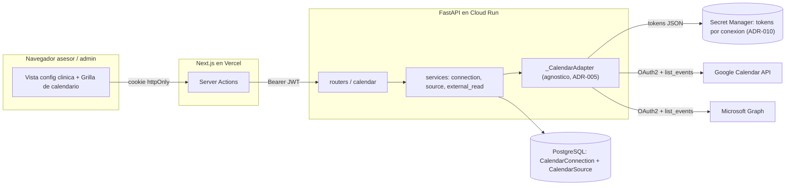
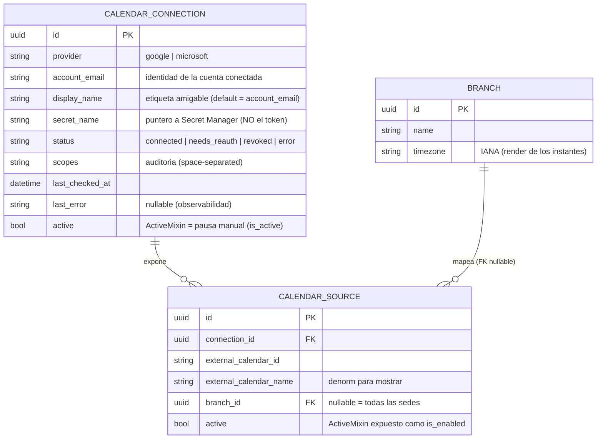

# Módulo `calendar`

> **Última actualización**: 2026-06-22
> **Estado**: 🎨 **Fase de documentación** (pre-F0). NADA implementado todavía.
> **Propósito**: integración de **calendario externo agnóstica al proveedor** (Google Calendar + Microsoft Outlook ahora; un 3ro vía CalDAV diferido), **configurable desde la vista de configuración de la clínica**. La **Fase 1** lee la ocupación externa (PULL) y la **muestra como overlay informativo no-bloqueante** sobre la grilla de `scheduling` — **sin tocar `compute_available_slots`** ni los invariantes de booking. Cierra **HU43** (pendiente) y la incoherencia de la tesis (que da el agendamiento "integrado con Google Calendar" por hecho). Es el **módulo #9** (el primero tras los 8 que cerraron medisage).
> **Path del código** (futuro): `backend/app/modules/calendar/` (backend) · `frontend/src/app/(main)/clinic/calendarios-externos/` (frontend de config) + un overlay en `frontend/src/app/(main)/scheduling/_components/CalendarGrid.tsx`.

> **Este documento es el overview**. Para el deep-dive ver:
> - 🔧 [`backend.md`](backend.md) — schemas Pydantic, contratos de API (request/response/errores), lógica de service, el adaptador agnóstico `_CalendarAdapter`, `secrets.put`, draft SQL de la migración `0025`.
> - 🎨 [`ui.md`](ui.md) — mockups por pantalla (config de la clínica, overlay en la grilla, aviso en el wizard), estados, componentes Fluent UI, UX writing en español.
> - ⚛️ [`frontend.md`](frontend.md) — archivos Next.js, server actions, Zod, navegación, types espejo.
>
> **Decisión de arquitectura**: [ADR-014](../../decisions/ADR-014-external-calendar-integration.md). **Diseño consolidado**: [`design.md`](design.md) (este README destila ese documento; la spec autoritativa que mantiene las 4 fichas consistentes vive aparte y, ante discrepancia, **gana la spec**).

## Resumen

`calendar` **no agenda ni calcula disponibilidad** — eso es `scheduling`. Lo que hace es **conectar la(s) cuenta(s) de calendario externo de la clínica** (Google / Microsoft), **mapear cada calendario a una sede** (`clinic.Branch`) y **leer sus eventos on-demand** para dibujarlos como una **capa visual distinta** (informativa, no-clicable para reservar) sobre la grilla de calendario existente. Es una capa **puramente aditiva**: la **Fase 1 no toca `scheduling.compute_available_slots`** ni `validate_booking_invariants` ([ADR-006](../../decisions/ADR-006-hybrid-calendar-slots.md)/[ADR-007](../../decisions/ADR-007-doctor-availability-concrete-blocks.md) quedan intactos), así que **es imposible que la integración introduzca un doble-booking o rompa una reserva**. Una caída del proveedor externo degrada con gracia (la capa externa se ve vacía + un aviso de salud, **nunca un 5xx**).

El módulo se construye **reutilizando tres patrones ya en producción**, sin inventar infraestructura:

```
                  ┌─ adaptador agnóstico   (ADR-005, molde bots/.../embedded.py `_PROVIDER_ADAPTERS`)
   calendar    = ─┤  secreto por-conexión  (ADR-010, app.core.secrets — se EXTIENDE con escritura `put`)
                  └─ Cloud Tasks           (ADR-012, SOLO para la fase de sync futura — no en F1/F2)
                       ↓
   CalendarConnection (cuenta OAuth, tokens en Secret Manager)  ──1:N──▶  CalendarSource (calendario → sede)
                       ↓                                                          ↓
   list_events(calendar_id, from, to)  (live, refresh al vuelo)        is_enabled=true  =  "el grupo de calendarios de la clínica"
                       ↓
   ExternalEvent[]  ──overlay informativo──▶  scheduling/CalendarGrid   ←  NO altera la disponibilidad ni el booking
```

**Alcance Fase 1 (DECIDIDO con el usuario, NO re-litigar — [ADR-014](../../decisions/ADR-014-external-calendar-integration.md) §"Decisiones de alcance"):**

- **Solo PULL**, **informativo**: el evento externo **se muestra**, **no bloquea** la disponibilidad.
- **Nivel CLÍNICA**: una (o pocas) **conexión(es) OAuth de la clínica**, con **N calendarios mapeados a sedes** ("global, pero con un calendario por sede adentro / un grupo de calendarios").
- **Detalle del evento** (título + horario), no free/busy opaco → scope **sensitive** → **verificación OAuth de Google** requerida antes de GA (es verificación, **NO** el assessment CASA).
- **Proveedores NATIVOS**: Google Calendar API + Microsoft Graph (vía `httpx.AsyncClient`, **no** el SDK sync de Google). Un 3ro (CalDAV) está diferido, pero la interfaz ya lo admite.

**DIFERIDO** (documentado como roadmap, **NO se construye** — ver [Fases](#implementación-por-fases)): **B1** modo bloqueante (busy externo → `compute_available_slots` MINUS, extiende [ADR-006](../../decisions/ADR-006-hybrid-calendar-slots.md)); **B2** per-doctor + push (`events.insert`, títulos PHI-min); **B3** sync por webhooks (Google watch / Graph subscriptions + syncToken/delta + renovación vía Cloud Tasks + tabla espejo `ExternalEvent`); **B4** 3er proveedor CalDAV (Apple iCloud / Fastmail / Nextcloud).

## Arquitectura

El navegador nunca habla con Google/Microsoft directamente: la lectura corre **server-side** en FastAPI (como todo en el template). Los tokens viven en Secret Manager; la BD guarda solo metadatos + el **puntero** al secreto.



> El adaptador es el calco del molde de bots ([ADR-005](../../decisions/ADR-005-agnostic-bot-engine.md), `backend/app/modules/bots/services/engine/embedded.py:69` — `_PROVIDER_ADAPTERS: dict[BotProvider, Callable[[str], _ProviderAdapter]]` + `Protocol` + import lazy del SDK). El motor de `calendar` habla con tipos neutros (`ExternalCalendar`, `ExternalEvent`), no con Google/Microsoft. Los diagramas de secuencia (conectar/mapear y lectura informativa best-effort) y el class diagram del `Protocol` están en [`design.md`](design.md) §3/§5.

## Entidades

2 entidades (Fase 1). Mixins: `PK`=`PrimaryKeyMixin`, `A`=`ActiveMixin`, `SD`=`SoftDeleteMixin`, `T`=`TimestampMixin`. `calendar` **no tiene M:N** ni catálogos en BD (los enums son code-level). Los **tokens NO viven en la BD** — viven en Secret Manager (ADR-010); la tabla solo guarda el puntero (`secret_name`).



| Entidad | Tabla | Mixins | Propósito |
|---|---|---|---|
| `CalendarConnection` | `calendar_connection` | PK·A·SD·T | Una cuenta OAuth externa conectada a **nivel CLÍNICA** (típicamente 1-2 filas). Expone N calendarios. |
| `CalendarSource` | `calendar_source` | PK·A·SD·T | Un calendario concreto dentro de una conexión, **mapeado a una sede** (`clinic.Branch`). El conjunto con `is_enabled=true` ES "el grupo de calendarios de la clínica". |

### `CalendarConnection` (cuenta OAuth de la clínica)

Una cuenta OAuth de la clínica (la cuenta de Google de la clínica y/o la de Outlook). `status` da salud de la conexión; `needs_reauth` se setea cuando el refresh devuelve `invalid_grant`. Los **tokens NO están aquí** — `secret_name` apunta al secreto `medisage-calendar-{id}-{env}` en Secret Manager con el JSON `{access_token, refresh_token, expiry, scopes}`.

- `provider: varchar(20)` NOT NULL — enum `CalendarProvider` (`google` | `microsoft`). Code-level, no catálogo en BD.
- `account_email: varchar(255)` NOT NULL — identidad de la cuenta (de Google `userinfo` / Graph `/me`).
- `display_name: varchar(120)` nullable — etiqueta amigable (default = `account_email`).
- `secret_name: varchar(255)` NOT NULL — puntero a Secret Manager (`medisage-calendar-{id}-{env}`).
- `status: varchar(20)` NOT NULL default `connected` — enum `ConnectionStatus` (`connected` | `needs_reauth` | `revoked` | `error`).
- `scopes: text` nullable — scopes concedidos (auditoría, space-separated).
- `last_checked_at: timestamptz` nullable — última validación/refresh OK.
- `last_error: varchar(500)` nullable — último error de refresh/list (observabilidad).
- `active` (ActiveMixin, expuesto `is_active`) = **pausa manual** de la conexión entera; `SD` (`deleted_at`) = **desconectar**.
- **UNIQUE PARCIAL** `(provider, account_email) WHERE deleted_at IS NULL` — no conectar 2 veces la misma cuenta.
- Relación `sources: list[CalendarSource]` 1:N, `lazy="raise"` (se carga con `selectinload` en el detalle).

### `CalendarSource` (calendario → sede)

Un calendario concreto dentro de una conexión, mapeado a una sede. `branch_id` **nullable** = "aplica a todas las sedes" (el caso "global"). El **flag "habilitado para lectura" reusa `ActiveMixin.active`** expuesto como `is_enabled` en el schema (precedente bots `BotConfigurationVersion.is_active` reusa `active`; **NO** una 2ª columna booleana).

- `connection_id: varchar(36)` FK→`calendar_connection.id` NOT NULL (**CASCADE**).
- `external_calendar_id: varchar(255)` NOT NULL — id del calendario en el proveedor.
- `external_calendar_name: varchar(255)` NOT NULL — denorm para mostrar (no server-sortable, regla `ALLOWED_FIELDS`).
- `branch_id: varchar(36)` FK→`clinic.branch.id` **nullable** (null = "todas las sedes"). FK **RESTRICT** (backstop ante hard-delete de una sede).
- `active` (ActiveMixin) expuesto como **`is_enabled`** — calendario incluido o no en la lectura del overlay.
- **UNIQUE PARCIAL** `(connection_id, external_calendar_id) WHERE deleted_at IS NULL`.

> **Resolución de la Q1** ("global pero con un calendario por sede / un grupo de calendarios"): **una conexión global** + **N `CalendarSource` mapeando calendario→sede**. Una sola cuenta de Google puede tener muchos calendarios. El modelo **crece sin reescritura** al caso per-doctor futuro (un `CalendarSource` mapeando a un doctor en vez de a una sede) y al push (un flag de calendario "destino").

> **Tabla DIFERIDA (fase de sync, documentar — NO crear):** `ExternalEvent` (espejo local cacheado de los eventos, con `sync_token`/`channel_id` por source, estilo `SelectedCalendar` de Cal.com). La Fase 1 lee **on-demand**, sin espejo ni webhooks → no la necesita.

## Enums (code-level, sin catálogo en BD)

En `enums.py`, mismo criterio que el resto de medisage (no son tablas; el código no hardcodea strings sueltos):

- `CalendarProvider(StrEnum)`: `google`, `microsoft`. (`caldav` reservado/comentado como futuro — **NO** seedeado/usado en Fase 1.)
- `ConnectionStatus(StrEnum)`: `connected`, `needs_reauth`, `revoked`, `error`.

## El adaptador agnóstico — `services/providers/`

Molde [ADR-005](../../decisions/ADR-005-agnostic-bot-engine.md) (`bots/services/engine/embedded.py:69`). Vive en `services/providers/` (NO `engine/` — es `calendar`, no `bots`): `base.py` (dataclasses neutras + `_CalendarAdapter` Protocol), `google.py` (`GoogleCalendarAdapter`), `microsoft.py` (`MicrosoftGraphAdapter`), `factory.py` (`_CALENDAR_ADAPTERS` + `get_adapter`). Los **tipos neutros** (`Credentials`, `ExternalCalendar`, `ExternalEvent`) son el equivalente del `ProviderResult` neutro de bots; las firmas exactas y el mapeo HTTP por proveedor están en [`backend.md`](backend.md).

```python
_CALENDAR_ADAPTERS: dict[CalendarProvider, Callable[[], _CalendarAdapter]] = {
    CalendarProvider.google: GoogleCalendarAdapter,
    CalendarProvider.microsoft: MicrosoftGraphAdapter,
    # CalendarProvider.caldav: CalDavAdapter,  # diferido (B4)
}
# get_adapter(provider) -> _CalendarAdapter  (lanza CALENDAR_PROVIDER_NOT_SUPPORTED si no está)
```

**Métodos del Protocol (Fase 1):** `build_auth_url(state, redirect_uri)` · `exchange_code(code, redirect_uri)` · `refresh(creds)` · `list_calendars(creds)` · `list_events(creds, calendar_id, time_min, time_max)`.
**Superficie FUTURA documentada (diseñada ahora, NO implementada):** `get_busy(...)` (modo bloqueante, B1) · `push_event/update_event/delete_event(...)` (push, B2) · `watch/unwatch/get_changes(...)` (sync, B3).

**Gotchas (de la investigación, a respetar):**
- **Google en "Testing"** emite refresh tokens de **7 días** → publicar la app OAuth "In production" (verificación) antes de GA.
- **TZ**: los eventos vienen como **instantes** RFC3339 con offset → normalizar con `_as_utc` (igual que `availability.py`) y ubicar en la grilla con los helpers `calendarWeek.ts` en **hora local del navegador**, **igual que las citas** de la grilla shippeada (el overlay comparte su base temporal; render de toda la grilla en la TZ de la sede = mejora diferida conjunta).
- **Outlook.com personal**: la lectura de eventos (`/calendarView`) funciona; documentar que `getSchedule` (futuro modo bloqueante, B1) **NO** soporta cuentas personales.

## Almacenamiento de tokens — extensión de `app.core.secrets` (ADR-010)

Hoy `secrets.resolve(name) -> dict` es read-only con cache TTL (`backend/app/core/secrets.py`). Se **agrega** `async secrets.put(name, payload) -> None` (crea el secreto si no existe + agrega versión; idempotente; invalida la cache) para escribir/rotar el access token refrescado. La SA de Cloud Run ya tiene `secretmanager.secretAccessor` a nivel proyecto → sumar `secretmanager.admin` (o `secretVersionAdder`). Error de resolución → `CALENDAR_CREDENTIALS_MISSING` (espeja `CHANNEL_CREDENTIALS_MISSING` de ADR-010). El **cliente OAuth (client_id/secret)** NO va por conexión: es **global por entorno** (Settings + `--set-secrets`), modelo single-tenant de Cal.com (un cliente OAuth a nivel app + N tokens por-cuenta). Detalle en [`backend.md`](backend.md).

## Endpoints (resumen)

Aggregator `routers/__init__.py` prefix `/calendar`, montado en `main.py` bajo `/api/v1/`. Convenciones del template: **`PUT` (no `PATCH`)**, `/active` (lista cruda sin envelope) donde aplica, el resto `SingleResponse`/`PaginatedResponse`, `ALLOWED_FIELDS` whitelist. El detalle request/response/errores está en [`backend.md`](backend.md#api-contracts).

| Método | Ruta | Permiso | Notas |
|---|---|---|---|
| `GET` | `/calendar/oauth/{provider}/start` | `CALENDAR_CONNECTIONS_WRITE` | Firma un `state` (JWT: actor_id + nonce + provider + return_to + exp corto) → `SingleResponse[OAuthStartResponse{auth_url}]`. |
| `GET` | `/calendar/oauth/{provider}/callback` | **PÚBLICO** (gateado por `state`) | Valida state → `exchange_code` → `secrets.put` → crea `CalendarConnection` → **302** al `return_to`. Errores → 302 `?calendar_error=CODE`. |
| `POST` | `/calendar/connections/list` | `CALENDAR_CONNECTIONS_READ` | `PaginatedResponse[CalendarConnectionItem]`. |
| `GET` | `/calendar/connections/{id}` | `CALENDAR_CONNECTIONS_READ` | `SingleResponse[CalendarConnectionDetail]` (incl. sources, `selectinload`). |
| `DELETE` | `/calendar/connections/{id}` | `CALENDAR_CONNECTIONS_WRITE` | 204. Soft-delete + best-effort revoke + borra el secreto. |
| `GET` | `/calendar/connections/{id}/calendars` | `CALENDAR_CONNECTIONS_WRITE` | Live `list_calendars` → `SingleResponse[list[ExternalCalendarOption]]` (UI de mapeo). |
| `PUT` | `/calendar/connections/{id}/sources` | `CALENDAR_CONNECTIONS_WRITE` | Bulk REPLACE atómico (soft-delete viejos + insert nuevos, patrón `clinic.OfficeOperatingHours`). Valida cada `branch_id` → 404 `BRANCH_NOT_FOUND`. |
| `GET` | `/calendar/external-events` | `CALENDAR_EXTERNAL_EVENTS_READ` | `?branch_id&from&to` → `ExternalEventsResponse{events, sources_health}`. **best-effort, nunca 5xx**. |

> **Orden de rutas**: las estáticas (`/oauth/...`, `/connections/list`, `/external-events`) ANTES de `/connections/{id}`.
> **`/external-events` (lectura informativa)**: resuelve los `CalendarSource` habilitados de la sede (`branch_id == X OR branch_id IS NULL`), agrupa por conexión, refresca el token si expiró, `list_events` por calendario. Si una conexión falla → marca su salud en `sources_health` y sigue. **best-effort, aislado** (regla no-negociable, lección §23): la grilla nunca recibe un 5xx ni se rompe.

## Permisos seed

4 permisos. Se consolidan en [`docs/modules/_seed-and-roles.md`](../_seed-and-roles.md) + `seed.py`:

```
MENU-CALENDAR ·
CALENDAR_CONNECTIONS_READ  (ver conexiones + sources + salud) ·
CALENDAR_CONNECTIONS_WRITE (conectar/desconectar + mapear calendarios→sedes; cubre OAuth start/callback + sources PUT) ·
CALENDAR_EXTERNAL_EVENTS_READ (leer el overlay en la grilla de scheduling)
```

**Roles seed** (forward-declarados completos en `seed.py`; `_seed_role` filtra los inexistentes → se autoactivan, patrón scheduling F0):

- `ADMIN` — los 4 (conecta, mapea, ve salud, ve overlay).
- `ASESOR` — `MENU-CALENDAR` + `CALENDAR_CONNECTIONS_READ` + `CALENDAR_EXTERNAL_EVENTS_READ` (config **read-only** + overlay; sin escritura).
- `DOCTOR` — `CALENDAR_EXTERNAL_EVENTS_READ` (solo ve el overlay en la grilla/su agenda; sin menú de config).

## Códigos de error

En el service (`detail` español, `code` inglés; nunca `HTTPException`):

| `code` | HTTP | Cuándo |
|---|---|---|
| `CALENDAR_CONNECTION_NOT_FOUND` | 404 | Conexión inexistente. |
| `CALENDAR_SOURCE_NOT_FOUND` | 404 | Source inexistente. |
| `CALENDAR_PROVIDER_NOT_SUPPORTED` | 400 | Provider fuera de `_CALENDAR_ADAPTERS`. |
| `CALENDAR_OAUTH_STATE_INVALID` | 400 | `state` CSRF inválido/expirado en el callback. |
| `CALENDAR_OAUTH_EXCHANGE_FAILED` | 400 | Exchange del `code` falló en el proveedor. |
| `CALENDAR_CONNECTION_ALREADY_EXISTS` | 409 | Misma `(provider, account_email)` ya conectada. |
| `CALENDAR_TOKEN_REFRESH_FAILED` | 400 | Refresh falló → marcar conexión `needs_reauth`. |
| `CALENDAR_CREDENTIALS_MISSING` | 400 | Secret no resoluble (espeja ADR-010). |
| `BRANCH_NOT_FOUND` | 404 | Mapear un source a una sede inexistente (valida FK antes de insertar, lección §20/§22). |

## UI (ES, Fluent v9, SIN estilo nuevo)

Dos superficies. Mockups ASCII por pantalla, estados (empty/loading/error/success) y componentes Fluent en [`ui.md`](ui.md); los archivos Next.js (actions, Zod, types espejo) en [`frontend.md`](frontend.md).

- **Nav**: child **"Calendarios externos"** en el grupo **"Clínica"** (junto a "Sedes"/"Consultorios", gated `MENU-CLINIC`), gateado por el permiso fino `CALENDAR_CONNECTIONS_READ` (`MENU-CALENDAR` reservado, igual que `MENU-SCHEDULING` en scheduling). Ruta `/clinic/calendarios-externos`. Ícono Fluent existente (verificar en el iconMap del Sidebar — `CalendarSyncRegular`, o `CalendarLtrRegular` de fallback).
- **Pantalla 1 — `/clinic/calendarios-externos`** (config de la clínica, molde = el shell de detalle con tabs de `clinic` + el mapeo multi-fila de `OfficeHoursTab`/`OfficeClosuresTab`): lista de conexiones (cards) con ícono del provider + `account_email` + badge de `status` (Conectada=success / Reconectar=warning / Error·Revocada=danger). Botones "Conectar Google" / "Conectar Outlook" (server action → `auth_url` → redirect). Por conexión, sus calendarios (de `list_calendars`): nombre + `<Dropdown>` de sede ("Todas las sedes" = `branch_id` null) + toggle `is_enabled` + "Guardar mapeo" (PUT sources). "Reconectar" / "Desconectar" (DELETE + ConfirmDialog). "Última revisión: hace N".
- **Pantalla 2 — overlay en `scheduling/CalendarGrid`** (lectura informativa, F2): los eventos externos se dibujan como **capa visual DISTINTA** (rayada/atenuada, etiqueta = título), separada de las citas medisage, con **leyenda** ("Cita medisage" vs "Evento externo"). **No-clicable para reservar**. Reusa `layoutOverlaps` + los helpers de `calendarWeek.ts` (hora local del navegador, igual que las citas). El `CalendarClient` llama además a `fetchExternalEvents(branch_id, from, to)` y pasa los eventos a `CalendarGrid` como prop nueva opcional `externalEvents`. Si la lectura falla → la grilla renderiza las citas normalmente + un aviso suave de salud (**nunca rompe la grilla**).
- **Pantalla 2.b (F2) — aviso suave en el `BookingWizard`**: si el slot elegido solapa un evento externo de esa sede → `MessageBar` informativo ("Hay un evento externo a esta hora") **sin** impedir la reserva (advisory).

## Settings + deploy

Nuevas Settings en `config.py` (defaults vacíos → módulo **inerte** hasta configurar credenciales; el smoke en ENV=dev no toca OAuth):

```python
# ── Calendar (módulo #9, ADR-014) ──
GOOGLE_OAUTH_CLIENT_ID: str = ""
GOOGLE_OAUTH_CLIENT_SECRET: str = ""        # Secret Manager
MICROSOFT_OAUTH_CLIENT_ID: str = ""
MICROSOFT_OAUTH_CLIENT_SECRET: str = ""     # Secret Manager
MICROSOFT_OAUTH_TENANT: str = "common"
CALENDAR_OAUTH_REDIRECT_BASE: str = ""      # base pública del callback (= SERVICE_BASE_URL, sin trailing slash)
```

- **Boot-validator** `_enforce_calendar_oauth` (espejo de `_enforce_bot_dispatch_secret`): si `GOOGLE_OAUTH_CLIENT_ID` está seteado y `ENV_NAME != dev` ⇒ exigir `GOOGLE_OAUTH_CLIENT_SECRET` no vacío o **NO arrancar** (falla **ruidosa** en vez de OAuth medio-configurado que falle solo en runtime); ídem Microsoft.
- **Deploy (lección §9/§11)**: agregar las env-vars a `--set-env-vars` y los `*_SECRET` a `--set-secrets` de **AMBOS** workflows (`deploy-backend-qa.yml` + `deploy-backend-prod.yml`). Secrets nuevos: `medisage-google-oauth-client-secret-{qa,prod}` + `medisage-microsoft-oauth-client-secret-{qa,prod}`.
- **Pre-GA**: publicar la app OAuth de Google "In production" (verificación de scope sensitive) + registrar la app en Entra ID (Microsoft).

## Dependencias entre módulos

| Módulo | Relación |
|---|---|
| `clinic` | `calendar_source.branch_id → clinic.branch.id` (FK nullable, RESTRICT) — destino del mapeo. `Branch.timezone` (IANA) para el render de los instantes externos. |
| `scheduling` | **Overlay (no FK)**: el overlay de eventos externos se dibuja en la grilla existente `CalendarGrid` (`frontend/src/app/(main)/scheduling/_components/CalendarGrid.tsx`, F4 de scheduling) reusando `layoutOverlaps` + `calendarWeek.ts`. **NO crea grilla nueva ni toca `compute_available_slots`/los invariantes de booking.** |
| `admin` | Audit (`created_by`/`updated_by` → `user.id`) + RBAC (los 4 permisos `CALENDAR_*`). El actor del callback OAuth = el `actor_id` codificado en el `state`. |
| `app.core` | **Reutiliza** `app.core.secrets` (resolver ADR-010, se **extiende** con `put`) + `app.core.config.Settings` (6 vars nuevas + boot-validator). |

> **Esta integración NO toca el agendamiento.** Los puntos de enganche que el modo bloqueante/push **futuros** tocarían (`availability.py` `busy`, `_has_overlap`/`validate_booking_invariants`, `appointment.py` tras crear la cita, `transition.py` cancel/reschedule) quedan **intactos** en Fase 1 — el detalle de qué se difiere y dónde engancharía está en [`design.md`](design.md) §9.

## Decisiones de diseño (LOCKED — de las 6 abiertas de `design.md` §11)

1. **F1 y F2 SEPARADAS** — validar OAuth/tokens en QA antes de construir la lectura encima.
2. **Lectura ON-DEMAND** (live, con refresh de token al vuelo), **SIN tabla espejo ni webhooks** en Fase 1. La sync con cache es B3 (diferida).
3. **`CalendarSource.branch_id` NULLABLE** = "todas las sedes" (cubre el caso "calendario global de la clínica").
4. **Overlay en la grilla de sede** de `scheduling` en F1/F2; "Mi agenda" del doctor se naturaliza con el per-doctor futuro (B2).
5. **Aviso suave en el wizard** entra en **F2** (barato; refuerza el valor informativo).
6. **Microsoft**: permitir lectura de Outlook.com personal (funciona); documentar la limitación de `getSchedule` para el futuro modo bloqueante (B1).

> **Por qué no una API unificada (Cronofy/Nylas)** y **por qué Secret Manager y no una columna encriptada**: ver [ADR-014](../../decisions/ADR-014-external-calendar-integration.md) §"Alternatives Considered" + [`design.md`](design.md) §6. Resumen: las APIs nativas son **gratis**, los datos quedan en medisage (mejor para la **Ley 29733**, sin procesador externo), sin lock-in; en Fase 1 hay **pocas conexiones** (nivel clínica) → el patrón ADR-010 (un secreto por cuenta) es consistente y simple. La envelope-encryption con Cloud KMS en columna Postgres se evalúa **solo** si se va a per-doctor (decenas/cientos de tokens).

## Cumplimiento y privacidad

Régimen real de medisage = **Ley N.º 29733 (Protección de Datos Personales, Perú)**, no HIPAA. Principio que sí aplica universalmente: **minimización de datos**. En la **Fase 1 no se exporta nada**: solo se **lee** el calendario propio de la clínica y se muestra a su staff (no se escribe ningún dato de paciente en un sistema de terceros). El dato sensible que sí custodiamos es el **token OAuth** → Secret Manager (cifrado en reposo, acceso por IAM, TTL de cache). Para la fase de push futura (B2): minimizar PHI en los títulos empujados (p. ej. "Cita - {id}" en vez del nombre del paciente).

## Implementación por fases

Migración inicial `0025` (revid ≤ 32 chars; la última aplicada es `0024_marketing_promotion_usage`). Molde global = **scheduling** (F0 inerte) + **clinic** (el shell de config + el mapeo multi-fila REPLACE) + **bots** (el adaptador agnóstico). Cada deep-dive ([`backend.md`](backend.md), [`ui.md`](ui.md), [`frontend.md`](frontend.md)) cierra con un checklist mapeado a estas fases.

| Fase | Alcance | Migración (revid ≤32) |
|---|---|---|
| **F0 — Prep** | 4 permisos `CALENDAR_*` en `SEED_PERMISSIONS` + role subsets (forward-declarados); nav child "Calendarios externos" en "Clínica" (+ iconMap); `endpoints.ts` bloque `CALENDAR`; `types/calendar.types.ts` espejo; Settings (6 vars + boot-validator `_enforce_calendar_oauth`); **paquete backend INERTE** (NO registrado en `modules/__init__.py`/`main.py`). Molde scheduling F0. QA E2E/PROD RO = login admin + assert perm count + rutas `/calendar/*` → 404. | ninguna (solo seed) |
| **F1 — Conexión + mapeo** | `CalendarConnection` + `CalendarSource` + adaptadores Google/Microsoft (`build_auth_url`/`exchange_code`/`refresh`/`list_calendars`) + `secrets.put` + OAuth start/callback + connections list/get/delete + `/calendars` + sources PUT (replace atómico) + **registrar el módulo** + UI config de la clínica. | `0025_calendar_connection` (down_revision `0024_marketing_promotion_usage`) |
| **F2 — Lectura informativa** | `list_events` en los adaptadores + `GET /external-events` (best-effort) + overlay en `CalendarGrid` (prop `externalEvents` + leyenda) + aviso suave en `BookingWizard`. | ninguna |
| **Diferidas (B1–B4)** | Modo bloqueante (B1) · per-doctor + push (B2) · sync por webhooks + `ExternalEvent` (B3) · 3er proveedor CalDAV (B4). **Documentadas como roadmap, NO se construyen.** Cada una es aditiva sobre la misma interfaz `_CalendarAdapter` + el mismo modelo `Connection`/`Source`. | — |

> **Migraciones**: revid ≤ 32 chars (`alembic_version varchar(32)`). `0025_calendar_connection` (24 chars) crea ambas tablas con las dos UNIQUE parciales `WHERE deleted_at IS NULL`; la FK `calendar_source.branch_id → branch.id` se declara a nivel de columna (RESTRICT, nullable). No hay JSONB en Fase 1.

## Referencias

- **Decisión**: [ADR-014](../../decisions/ADR-014-external-calendar-integration.md) (adaptador agnóstico, proveedores nativos, Fase 1 = lectura informativa a nivel clínica).
- **Diseño consolidado**: [`design.md`](design.md) (arquitectura, modelo de datos, flujos OAuth, secuencias, UI, roadmap, diagramas mermaid).
- **Deep-dives**: [`backend.md`](backend.md) · [`ui.md`](ui.md) · [`frontend.md`](frontend.md).
- **ADRs reutilizados**: [ADR-005](../../decisions/ADR-005-agnostic-bot-engine.md) (adaptador agnóstico — molde), [ADR-006](../../decisions/ADR-006-hybrid-calendar-slots.md) (disponibilidad on-the-fly — el modo bloqueante futuro la extiende), [ADR-010](../../decisions/ADR-010-runtime-secret-resolution.md) (secreto por-cuenta), [ADR-012](../../decisions/ADR-012-cloud-tasks-bot-dispatch.md) (Cloud Tasks — sync futura).
- **Módulos relacionados**: [`scheduling`](../scheduling/README.md) (la grilla + el motor de disponibilidad), [`clinic`](../clinic/README.md) (`Branch`/`timezone`), [`staff`](../staff/README.md) (`Doctor` — destino del per-doctor futuro B2).
- **Código (puntos de enganche)**: `backend/app/modules/bots/services/engine/embedded.py:69` (`_PROVIDER_ADAPTERS`, molde del adaptador), `backend/app/core/secrets.py` (resolver de secretos — se extiende con `put`), `backend/app/modules/scheduling/services/availability.py` (disponibilidad on-the-fly, intacta), `frontend/src/app/(main)/scheduling/_components/CalendarGrid.tsx` (overlay), `frontend/src/lib/utils/calendarWeek.ts` (`layoutOverlaps` + helpers TZ).
- **Docs externos**: [Google Calendar API v3](https://developers.google.com/workspace/calendar/api/v3/reference), [scopes sensitive vs restricted](https://support.google.com/cloud/answer/13464325), [Google OAuth verification](https://developers.google.com/identity/protocols/oauth2/production-readiness/sensitive-scope-verification), [Microsoft Graph calendars](https://learn.microsoft.com/en-us/graph/api/resources/calendar), [Cal.com `Calendar` interface](https://github.com/calcom/cal.com/blob/main/packages/types/Calendar.d.ts) (blueprint).
</content>
</invoke>
