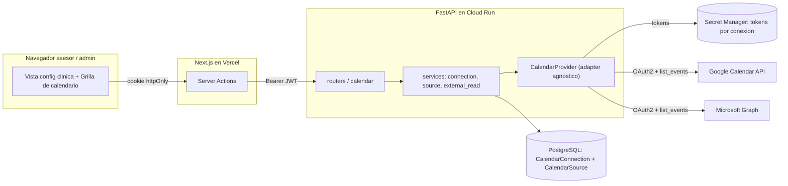
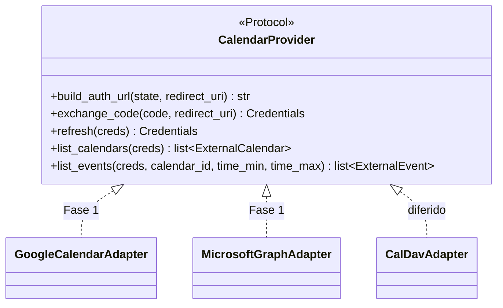
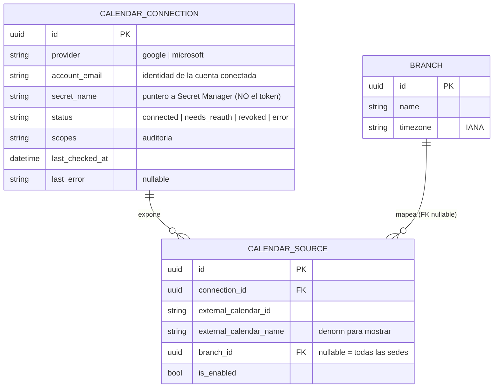
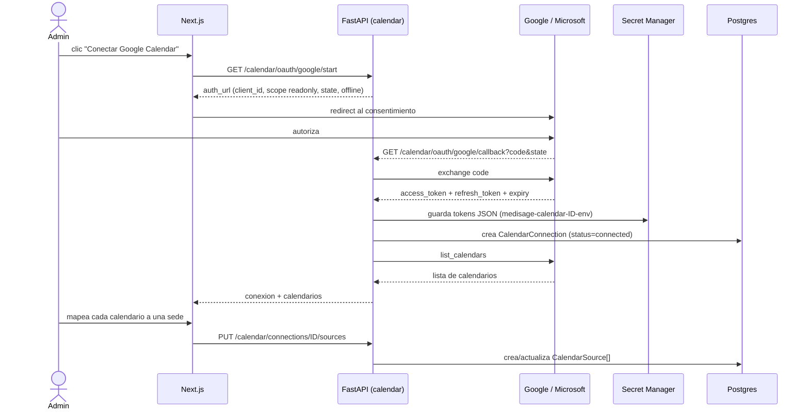
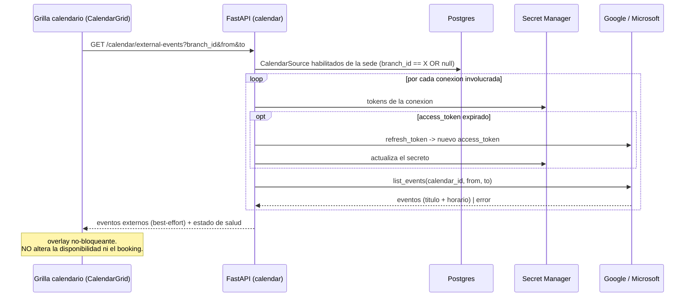
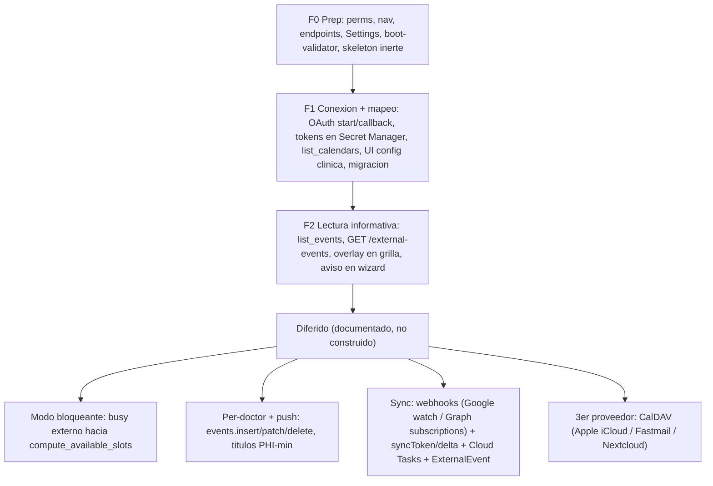

# Módulo `calendar` — Documento de diseño

> **Última actualización**: 2026-06-22
> **Estado**: 🎨 **Diseño / discusión** (pre-implementación). NO hay código todavía.
> **Decisión de arquitectura**: [ADR-014](../../decisions/ADR-014-external-calendar-integration.md).
> **Propósito**: integración de **calendario externo agnóstica al proveedor** (Google Calendar + Microsoft Outlook ahora; un 3ro vía CalDAV después), configurable desde la **vista de configuración de la clínica**. Resuelve **HU43** (pendiente) y la incoherencia de la tesis (que da el agendamiento "integrado con Google Calendar" por hecho).

> Este documento es el **diseño consolidado** de esta fase. Antes de F0 se desglosa en las 4 fichas de costumbre (`README.md` + `backend.md` + `ui.md` + `frontend.md`) en la fase de documentación. Aquí va la arquitectura, el modelo de datos, los flujos, la UI y el roadmap por fases.

---

## 1. Resumen ejecutivo

Hoy `scheduling` calcula la disponibilidad **on-the-fly** ([ADR-006](../../decisions/ADR-006-hybrid-calendar-slots.md)/[ADR-007](../../decisions/ADR-007-doctor-availability-concrete-blocks.md)) sin ningún calendario externo. Este módulo agrega una integración **agnóstica** construida **reutilizando tres patrones que ya están en producción**:

| Patrón existente | ADR | Rol en `calendar` |
|---|---|---|
| Adaptador de proveedores (motor de bots, `_PROVIDER_ADAPTERS`) | [ADR-005](../../decisions/ADR-005-agnostic-bot-engine.md) | El `CalendarProvider` agnóstico: `Protocol` común + dict por proveedor + import lazy del SDK. |
| Secreto por-cuenta en Secret Manager | [ADR-010](../../decisions/ADR-010-runtime-secret-resolution.md) | Los tokens OAuth **por conexión** viven en Secret Manager (JSON), no en una columna de la BD. |
| Despacho async vía Cloud Tasks | [ADR-012](../../decisions/ADR-012-cloud-tasks-bot-dispatch.md) | (Fase futura de sync) renovación de webhooks + reconciliación. |

**Alcance de la Fase 1 (decidido con el usuario, 2026-06-22):**

- **Solo PULL** (leer ocupación externa), **informativo** — se **muestra** como overlay, **no bloquea** la disponibilidad. La Fase 1 **no toca `compute_available_slots`** → es imposible que rompa el agendamiento.
- **Nivel clínica**: una (o pocas) **conexión(es) OAuth de la clínica**, con **N calendarios mapeados a sedes** ("global, pero con un calendario por sede adentro").
- **Detalle del evento** (título + horario), no free/busy opaco → scope sensible → **verificación OAuth de Google** requerida antes de GA.
- **Proveedores nativos**: Google Calendar API + Microsoft Graph. El 3ro (CalDAV) se difiere; la interfaz ya lo admite.

**Lo que NO es la Fase 1** (diferido, documentado en §9): modo bloqueante, conexiones por doctor, push de citas, sync por webhooks, 3er proveedor.

---

## 2. Arquitectura



El navegador nunca habla con Google/Microsoft directamente (la lectura corre **server-side** en FastAPI, como todo en el template). Los tokens viven en Secret Manager; la BD solo guarda metadatos + el **puntero** al secreto.

---

## 3. El adaptador agnóstico `CalendarProvider`

Calcado del molde de bots (`backend/app/modules/bots/services/engine/embedded.py:69`, `_PROVIDER_ADAPTERS: dict[BotProvider, Callable[..., _ProviderAdapter]]` + `Protocol` + import lazy del SDK). El motor de `calendar` habla con tipos neutros (`ExternalCalendar`, `ExternalEvent`), no con Google/Microsoft.



**Tipos neutros** (formato agnóstico, igual que el `ProviderResult` neutro de bots):

```python
@dataclass
class Credentials:           # lo que vive en Secret Manager (JSON)
    access_token: str
    refresh_token: str | None
    expiry: datetime          # UTC-aware
    scopes: list[str]

@dataclass
class ExternalCalendar:       # para la UI de mapeo
    id: str                   # external_calendar_id del proveedor
    name: str
    primary: bool

@dataclass
class ExternalEvent:          # lo que se muestra en el overlay (Fase 1)
    external_id: str
    title: str                # detalle (Q3): titulo + horario
    starts_at: datetime       # instante UTC-aware
    ends_at: datetime
    all_day: bool
```

```python
_CALENDAR_ADAPTERS: dict[CalendarProvider, Callable[[str], _CalendarAdapter]] = {
    CalendarProvider.google: GoogleCalendarAdapter,
    CalendarProvider.microsoft: MicrosoftGraphAdapter,
    # CalendarProvider.caldav: CalDavAdapter,  # diferido
}
```

**Superficie futura de la interfaz** (diseñada ahora, NO implementada en Fase 1) — lo que habilita cada fase diferida sin reescribir el contrato:

- `get_busy(creds, calendar_ids, time_min, time_max) -> list[BusyInterval]` → **modo bloqueante** (alimentar el `busy` de `compute_available_slots`).
- `push_event/update_event/delete_event(...)` → **push** de las citas medisage.
- `watch(...) / unwatch(...) / get_changes(sync_state)` → **sync por webhooks** (Google watch / Graph subscriptions + syncToken/delta).

### 3.1 Mapeo a cada proveedor (Fase 1)

| Operación | **Google Calendar API** | **Microsoft Graph** |
|---|---|---|
| OAuth | Authorization Code + `access_type=offline` + `prompt=consent` (para refresh token) | Authorization Code + `offline_access` (Entra ID) |
| Scope (detalle, Q3) | `calendar.readonly` o `calendar.events.readonly` (**sensitive** → verificación OAuth) | `Calendars.Read` (delegado) |
| Listar calendarios | `GET /users/me/calendarList` | `GET /me/calendars` |
| Leer eventos en rango | `GET /calendars/{id}/events?timeMin&timeMax&singleEvents=true` | `GET /me/calendars/{id}/calendarView?startDateTime&endDateTime` |
| Refresh | token endpoint con `grant_type=refresh_token` | token endpoint con `grant_type=refresh_token` |
| Costo | **API gratis** | **API gratis** (costo = licencia M365 del cliente) |

**Gotchas confirmados en la investigación** (a respetar en la implementación):
- **Google "Testing" status** emite refresh tokens de **7 días** → publicar la app OAuth "In production" antes de GA.
- **Microsoft Outlook.com personal** es de segunda (sin `getSchedule`); para detalle de eventos `/calendarView` sí funciona. Apuntar a tenants M365 work/school para el caso serio.
- **TZ**: los eventos vienen como **instantes** (RFC3339 con offset). Se normalizan con el helper `_as_utc` (igual que en `availability.py`) y se ubican en la grilla con los helpers `calendarWeek.ts` ya existentes en **hora local del navegador**, igual que las citas (render de toda la grilla en la TZ de la sede = mejora diferida conjunta). No hay resolución de hora de pared (a diferencia de `OperatingHours`).

---

## 4. Modelo de datos (Fase 1)

Dos entidades nuevas. Mixins del template: `PK`=`PrimaryKeyMixin`, `A`=`ActiveMixin`, `SD`=`SoftDeleteMixin`, `T`=`TimestampMixin`.



- **`CalendarConnection`** (`PK·A·SD·T`) — una cuenta OAuth de la clínica. Típicamente 1-2 filas (la cuenta de Google de la clínica, y/o la de Outlook). Los **tokens NO están aquí**: `secret_name` apunta al secreto `medisage-calendar-{id}-{env}` en Secret Manager con el JSON `{access_token, refresh_token, expiry, scopes}`. `status` da salud de la conexión (`needs_reauth` cuando el refresh devuelve `invalid_grant`).
- **`CalendarSource`** (`PK·A·SD·T`) — un calendario concreto dentro de una conexión, mapeado a una **sede** (`clinic.Branch`). `branch_id` **nullable** = "aplica a todas las sedes" (el caso "global"). El conjunto de `CalendarSource` con `is_enabled=true` **ES** "el grupo de calendarios de la clínica". UNIQUE `(connection_id, external_calendar_id)`.

> **Resolución de la duda de Q1** ("global pero con un calendario por sede / un grupo de calendarios"): se modela como **una conexión global** + **N `CalendarSource` mapeados a sedes**. Una sola cuenta de Google puede tener muchos calendarios; Google permite consultar hasta 50 de golpe y Microsoft ~20. Así "global" (una conexión) y "un calendario por sede" (los sources) conviven sin contradicción, y el modelo **crece** al caso per-doctor futuro (un `CalendarSource` mapeando a un doctor en vez de a una sede) y al push (un flag de "calendario destino").

**Tabla diferida (Fase de sync)**: `ExternalEvent` (espejo local cacheado de los eventos, con `sync_token`/`channel_id` por source, estilo `SelectedCalendar` de Cal.com) — solo se crea cuando se pase de lectura on-demand a sync por webhooks. La Fase 1 **no la necesita**.

---

## 5. Flujos

### 5.1 Conectar y mapear (vista de configuración de la clínica)



`state` es un token CSRF firmado (anti-replay). El `callback` es un endpoint público del backend (como el webhook de WhatsApp) que valida `state` y cierra la ventana OAuth.

### 5.2 Lectura informativa (overlay no-bloqueante)



**Aislamiento (regla no-negociable, lección §23)**: la lectura externa es **best-effort**. Si una conexión falla (token revocado, proveedor caído, rate limit), la respuesta marca esa fuente como no-disponible y devuelve el resto; la grilla renderiza las citas medisage normalmente + un aviso de salud de la conexión. **Nunca un 5xx, nunca bloquea la grilla ni la reserva.**

---

## 6. Almacenamiento de tokens y seguridad

- **Tokens OAuth por conexión** → Secret Manager (`medisage-calendar-{connection_id}-{env}`), reusando `app.core.secrets` (hoy read-only con cache TTL; se **extiende** con escritura/rotación para guardar el access token refrescado). La SA de Cloud Run ya tiene `secretmanager.secretAccessor` a nivel proyecto; hay que sumar `secretmanager.admin` (o `secretVersionAdder` + `secretVersionManager`) para crear/rotar.
- **Cliente OAuth (client_id/secret) por proveedor** → **global por entorno** (Settings + `--set-secrets`), no por conexión. Es el modelo single-tenant de Cal.com (un cliente OAuth a nivel app + N tokens por-cuenta).
- **Por qué Secret Manager y no una columna encriptada**: en la Fase 1 hay **pocas conexiones** (nivel clínica), así que el patrón ADR-010 (un secreto por cuenta) es consistente y simple. **Nota de escala**: si en el futuro se va a **per-doctor** (decenas/cientos de tokens), conviene evaluar **envelope encryption con Cloud KMS en una columna Postgres** (una master key cifra data-keys por cuenta) — es el patrón estándar para "un secreto por usuario". Se decide en la fase per-doctor, no ahora.
- **`invalid_grant` (revocación)** → marcar la conexión `needs_reauth` y mostrar "Reconectar" en la UI. Nunca reintentar en loop.

---

## 7. Permisos (RBAC), navegación y endpoints

**Permisos** (resueltos en la fase de doc — 4): `MENU-CALENDAR`, `CALENDAR_CONNECTIONS_{READ,WRITE}` (`_WRITE` cubre también el mapeo calendario→sede; no hay `CALENDAR_SOURCES_*` separado), `CALENDAR_EXTERNAL_EVENTS_READ`.
- **ADMIN**: los 4 (conecta, mapea, ve salud + overlay).
- **ASESOR**: `MENU-CALENDAR` + `CALENDAR_CONNECTIONS_READ` (config read-only) + `CALENDAR_EXTERNAL_EVENTS_READ`.
- **DOCTOR**: solo `CALENDAR_EXTERNAL_EVENTS_READ` (ve el overlay en la grilla, sin el menú de config).

**Endpoints** (bajo `/api/v1/calendar/`):
- `GET /oauth/{provider}/start` → `auth_url` (CALENDAR_CONNECTIONS_WRITE).
- `GET /oauth/{provider}/callback` → público (valida `state`), cierra el OAuth.
- `GET/POST /connections`, `GET /connections/{id}`, `DELETE /connections/{id}` (desconectar) — CONNECTIONS_*.
- `GET /connections/{id}/calendars` → `list_calendars` live (para la UI de mapeo).
- `GET/PUT /connections/{id}/sources` → CRUD del mapeo calendario→sede — SOURCES_*.
- `GET /external-events?branch_id&from&to` → lectura informativa (EXTERNAL_EVENTS_READ).

**Navegación**: un ítem "Calendarios externos" en el grupo "Clínica" del sidebar, gateado por el permiso fino `CALENDAR_CONNECTIONS_READ` (`MENU-CALENDAR` reservado, igual que `MENU-SCHEDULING`). El overlay aparece en la grilla existente de `scheduling` (`/scheduling/calendario`), no en una página nueva.

---

## 8. UI (vista de configuración de la clínica + overlay)

**Vista de config de la clínica — "Calendarios externos"** (molde: el shell de detalle con tabs de `clinic`):

```
┌─ Calendarios externos ─────────────────────────────────────────┐
│  [ + Conectar Google ]   [ + Conectar Outlook ]                 │
│                                                                  │
│  Conexión: clinica@gmail.com (Google)        ● Conectada        │
│    ├─ "Sede Miraflores"   → [ Sede Miraflores ▾ ]   [x] activo   │
│    ├─ "Sede San Isidro"   → [ Sede San Isidro ▾ ]   [x] activo   │
│    └─ "Personal"          → [ (no mapear)     ▾ ]   [ ] activo   │
│    [ Reconectar ]  [ Desconectar ]   Últ. revisión: hace 3 min   │
│                                                                  │
│  Conexión: recepcion@clinica.com (Outlook)   ⚠ Reconectar       │
└──────────────────────────────────────────────────────────────────┘
```

- Badges de salud por conexión (`Conectada` / `Reconectar` / `Error`).
- Cada calendario de la conexión se mapea a una sede (dropdown de `Branch`, opción "todas las sedes" = `branch_id` null) + toggle `is_enabled`.
- Botón de conectar dispara el OAuth (popup/redirect).

**Overlay en la grilla** (`scheduling/_components/CalendarGrid.tsx`, F4): los eventos externos se dibujan como una **capa visual distinta** (rayada/atenuada, etiqueta con el título), claramente separada de las citas medisage, con una **leyenda** ("Cita medisage" vs "Evento externo"). Es **no-clicable para reservar** (informativo). Reusa la maquinaria de solapamiento (`layoutOverlaps`) y los helpers TZ (`calendarWeek.ts`) ya existentes.

**Aviso suave en el wizard de reserva** (opcional, Fase 1.x): si el slot elegido solapa un evento externo de esa sede, mostrar un `MessageBar` informativo ("Hay un evento externo a esta hora") — **sin** impedir la reserva (es advisory).

---

## 9. Cómo esta integración NO toca el agendamiento

| Punto de enganche en el código actual | Fase 1 (informativa) | Diferido |
|---|---|---|
| `availability.py:240` — el `busy` de `compute_available_slots` | **NO se toca** | Modo **bloqueante**: unir el busy externo como un MINUS extra (extiende [ADR-006](../../decisions/ADR-006-hybrid-calendar-slots.md)) |
| `availability.py` — `_has_overlap` / `validate_booking_invariants` | **NO se toca** | Modo bloqueante en el booking |
| `appointment.py:287` — tras crear la cita | **NO se toca** | **Push**: encolar (Cloud Tasks) la creación del evento externo |
| `transition.py` — cancel/reschedule | **NO se toca** | Push: update/delete del evento externo |
| `CalendarGrid.tsx` (frontend) | **overlay nuevo** (capa de lectura) | — |

La Fase 1 es **puramente aditiva** (un módulo nuevo + una capa de lectura en la grilla). El corazón de `scheduling` queda intacto, así que la integración **no puede introducir un bug de doble-booking ni romper una reserva**.

### Roadmap por fases



- **F0 — Prep** (sin migración): permisos `CALENDAR_*` en seed + subsets de rol + nav + `endpoints.ts` + `types/calendar.types.ts` + Settings (client_id/secret por proveedor + redirect base) + **boot-validator** (si un provider tiene client_id, exigir su secret — espejo de `_enforce_bot_dispatch_secret`) + paquete backend inerte (no registrado). Molde: scheduling F0.
- **F1 — Conexión + mapeo**: `CalendarConnection` + `CalendarSource` + adaptadores Google/Microsoft (OAuth start/exchange/refresh + `list_calendars`) + escritura de tokens en Secret Manager + endpoints de conexión/sources + UI de config de la clínica. Migración `00NN_calendar_connection`.
- **F2 — Lectura informativa**: `list_events` en los adaptadores + `GET /external-events` + overlay en `CalendarGrid` + aviso en el wizard. (Puede fusionarse con F1 si se prefiere un solo entregable; recomiendo separarlas — F1 valida el OAuth/tokens en QA antes de construir la lectura encima.)
- **Diferidas (B1-B4)**: ver el diagrama. Cada una es aditiva sobre la misma interfaz `CalendarProvider` + el mismo modelo `Connection`/`Source`.

---

## 10. Cumplimiento y privacidad

El régimen real de medisage es la **Ley N.º 29733 (Protección de Datos Personales, Perú)**, no HIPAA (la investigación enmarca todo en HIPAA porque es el lente dominante en las fuentes, pero no es el marco aplicable). El principio que **sí** aplica universalmente es la **minimización de datos**:

- En la **Fase 1 no se exporta nada**: solo se **lee** el calendario propio de la clínica y se muestra a su staff. No se escribe ningún dato de paciente en un sistema de terceros.
- El dato sensible que sí custodiamos es el **token OAuth** → Secret Manager (cifrado en reposo, acceso por IAM, TTL de cache).
- **Para la fase de push futura**: minimizar PHI en los títulos empujados (p. ej. "Cita - {id}" en vez del nombre del paciente), como hacen Healthie/SimplePractice.

---

## 11. Decisiones abiertas (a confirmar en la fase de documentación, antes de F0)

1. **¿F1 y F2 separadas o un solo entregable?** Recomendado: **separadas** (validar OAuth/tokens en QA antes de la lectura).
2. **¿Lectura on-demand vs cache?** Recomendado: **on-demand** en Fase 1 (sin webhooks ni tabla espejo); la sync con cache es una fase diferida cuando importe la frescura/escala.
3. **¿`CalendarSource.branch_id` nullable = "todas las sedes"** o se exige siempre una sede? Recomendado: **nullable** (cubre el caso "calendario global de la clínica").
4. **¿El overlay vive solo en la grilla de `scheduling` o también en "Mi agenda" del doctor?** Recomendado: la grilla de sede en Fase 1; "Mi agenda" se naturaliza cuando llegue el per-doctor.
5. **¿`aviso suave en el wizard`** entra en F2 o se difiere? Recomendado: F2 (es barato y refuerza el valor informativo).
6. **Microsoft**: ¿se soporta Outlook.com personal (lectura de eventos sí funciona) o solo tenants M365 work/school? Recomendado: permitir ambos en lectura; documentar la limitación de `getSchedule` para el futuro modo bloqueante.

---

## 12. Referencias

- **Decisión**: [ADR-014](../../decisions/ADR-014-external-calendar-integration.md).
- **ADRs reutilizados**: [ADR-005](../../decisions/ADR-005-agnostic-bot-engine.md), [ADR-006](../../decisions/ADR-006-hybrid-calendar-slots.md), [ADR-010](../../decisions/ADR-010-runtime-secret-resolution.md), [ADR-012](../../decisions/ADR-012-cloud-tasks-bot-dispatch.md).
- **Módulos relacionados**: [`scheduling`](../scheduling/README.md) (la grilla + el motor de disponibilidad), [`clinic`](../clinic/README.md) (`Branch`/`timezone`), [`staff`](../staff/README.md) (`Doctor` — destino del per-doctor futuro).
- **Código (puntos de enganche)**: `backend/app/modules/bots/services/engine/embedded.py` (molde del adaptador), `backend/app/core/secrets.py` (resolver de secretos), `backend/app/modules/scheduling/services/availability.py` (disponibilidad on-the-fly), `frontend/src/app/(main)/scheduling/.../CalendarGrid.tsx` (overlay).
- **Docs externos**: [Google Calendar API v3](https://developers.google.com/workspace/calendar/api/v3/reference), [Google scopes sensitive vs restricted](https://support.google.com/cloud/answer/13464325), [Google OAuth verification](https://developers.google.com/identity/protocols/oauth2/production-readiness/sensitive-scope-verification), [Microsoft Graph calendar](https://learn.microsoft.com/en-us/graph/api/resources/calendar), [Cal.com `Calendar` interface](https://github.com/calcom/cal.com/blob/main/packages/types/Calendar.d.ts).
