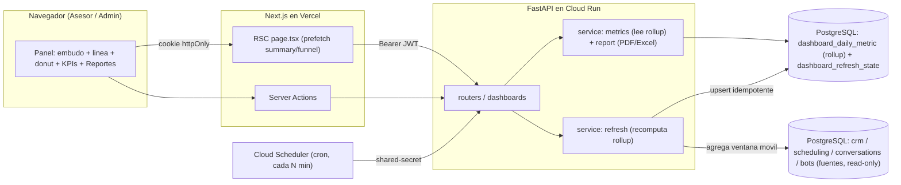
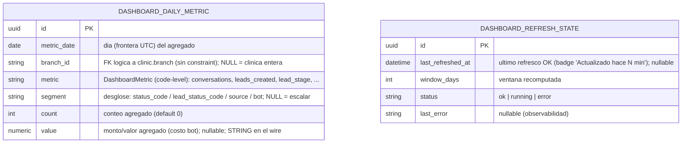
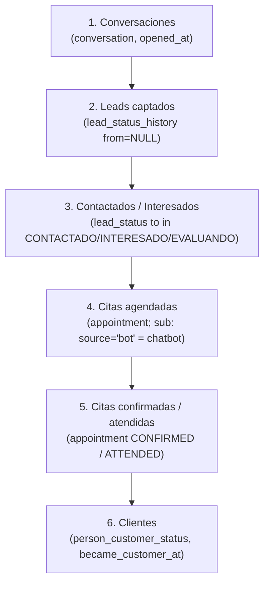
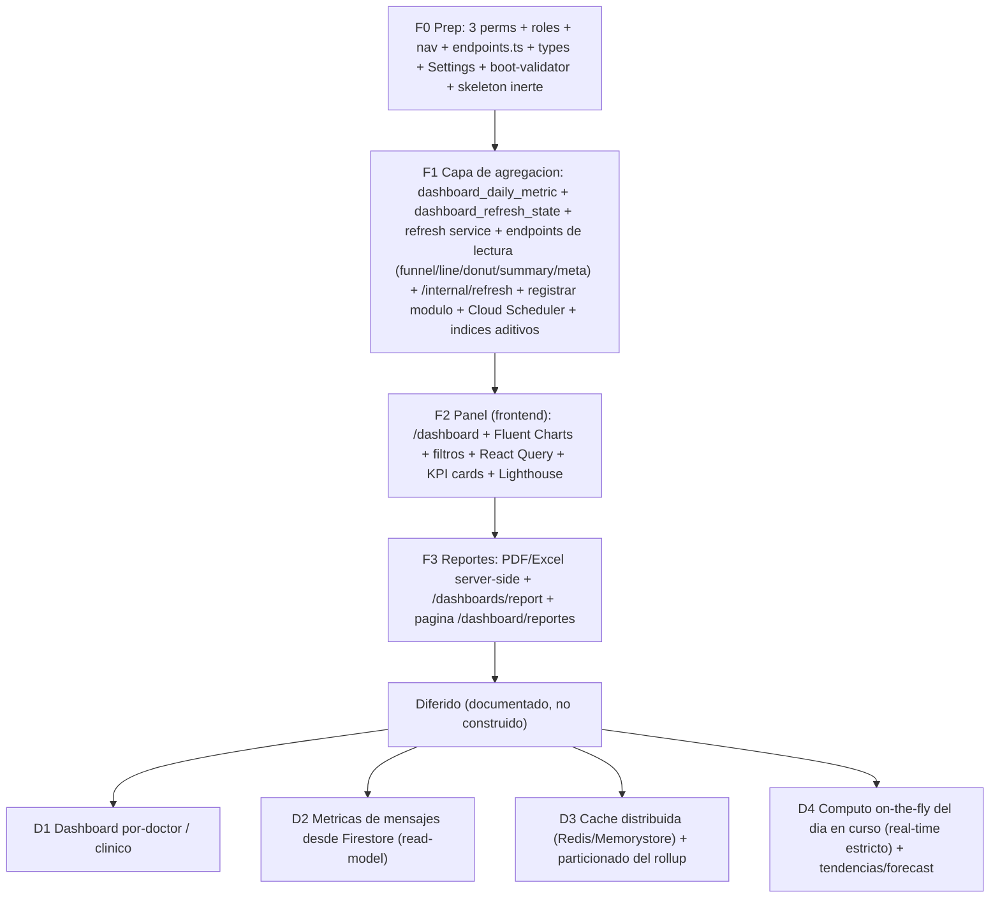

# Módulo `dashboards`

> **Última actualización**: 2026-06-24
> **Estado**: 🎨 **Fase de documentación** (pre-F0). NADA implementado todavía.
> **Propósito**: **visualización de resultados y reportes en tiempo real** (OE3 de la tesis) centrado en un **embudo de conversión** (del primer contacto a la cita confirmada / cliente), más **evolución de leads** (línea), **distribución de citas** (donut), **KPIs** y **reportes exportables a PDF/Excel** (HU26 + HU27, épica E07). Es **READ-ONLY**: **no crea entidades de negocio** — la data del embudo **ya existe en producción** (crm, scheduling, conversations, bots, marketing); este módulo solo la **agrega** y la **visualiza**. Su única persistencia nueva es la **capa de agregación materializada** (un *rollup* diario refrescado por un job programado), para cumplir el **RNF-05** (panel ≤ 3 s p95, LCP ≤ 2.5 s) sin recomputar agregaciones pesadas en cada carga. Cierra **OE3**, las **HU26/HU27** (hoy PENDIENTE en backlog), el **RNF-05** real, y elimina la incoherencia de la tesis (Cap.6 da el dashboard por "desplegado y funcionando" con Figuras 17/18/19 de un sistema anterior que ya no existe). Es el **módulo #10** (tras los 8 de dominio + `calendar` #9).
> **Path del código** (futuro): `backend/app/modules/dashboards/` (backend, service `metrics` + `refresh` + `report`) · `frontend/src/app/(main)/dashboard/` (panel, reemplaza el placeholder de bienvenida) + `frontend/src/app/(main)/dashboard/reportes/` (reportes).

> **Este documento es el overview**. Para el deep-dive ver:
> - 🔧 [`backend.md`](backend.md) — schemas Pydantic (DashboardFilter / FunnelSummary / TimeSeries / DistributionSummary / KpiSummary / DashboardMeta / RefreshResult), contratos de API (request/response/errores), el cómputo EXACTO del rollup (fórmulas SQL con citas `path:línea`), el service `refresh`, la generación server-side de PDF/Excel, draft SQL de la migración `0026`.
> - 🎨 [`ui.md`](ui.md) — mockups por pantalla (panel + reportes), estados (loading/sin-datos/error por widget), componentes Fluent UI Charts, UX writing en español.
> - ⚛️ [`frontend.md`](frontend.md) — archivos Next.js, server actions (reads + generación de reporte), navegación + íconos, React Query (`refetchInterval`), types espejo, integración de `@fluentui/react-charts`.
>
> **Decisión de arquitectura**: [ADR-015](../../decisions/ADR-015-dashboards-materialized-aggregation.md). **Diseño consolidado**: [`design.md`](design.md) (este README destila ese documento; la spec autoritativa que mantiene las 4 fichas consistentes vive aparte y, ante discrepancia, **gana la spec**).

## Resumen

`dashboards` **no agenda, no captura leads ni muta el embudo** — eso lo hacen crm / scheduling / conversations / bots. Lo que hace es **agregar** lo que esos módulos ya escribieron y **visualizarlo**. El embudo de conversión se une **enteramente por `person_id`** (toda entidad del recorrido cuelga de `crm.Person`). Es una capa **100% lectura/agregación**: no toca `compute_available_slots`, ni el booking, ni un solo flujo de los otros módulos → **es imposible que el dashboard introduzca un bug funcional en el embudo**. Una falla del job de refresco **degrada con gracia** (el panel sirve el último rollup bueno + el badge "Actualizado hace N min" que crece; nunca un 5xx).

El módulo se construye **reutilizando patrones ya en producción**, sin inventar infraestructura:

```
                   ┌─ métrica agregada no-paginada   (molde marketing.usage_summary → SingleResponse[X])
   dashboards  = ──┤  shared-secret + Cloud Scheduler (molde ADR-012, el job de refresco)
                   └─ estados configurables          (ADR-008, resolver por code/flags — nunca id hardcodeado)
                        ↓
   FUENTES (read-only, prod)                      CAPA NUEVA (este módulo)               UI
   ┌─ crm: lead/customer status + *_history ─┐    ┌─ dashboard_daily_metric (rollup) ─┐  ┌─ Panel /dashboard ─┐
   ├─ scheduling: appointment + status ──────┤──▶ │  (día × sede × métrica × segmento │─▶│ embudo + línea +    │
   ├─ conversations: conversation ───────────┤    │   → count / value)                │  │ donut + KPIs        │
   └─ bots: bot_event (turnos / costo) ──────┘    │  refrescado por job (Cloud Sched.)│  └─ Reportes /…/reportes
                                                  └─ dashboard_refresh_state ─────────┘    (PDF/Excel server-side)
```

**Alcance (DECIDIDO con el usuario — AskUserQuestion 2026-06-24, NO re-litigar — [ADR-015](../../decisions/ADR-015-dashboards-materialized-aggregation.md)):**

- **Embudo COMPLETO cross-módulo** (6 etapas): `Conversaciones → Leads → Contactados/Interesados → Citas agendadas → Citas confirmadas → Clientes`.
- **Agregación MATERIALIZADA / precomputada + caché** (sobre on-the-fly): rollup diario en Postgres refrescado por un job programado (Cloud Scheduler + endpoint con shared-secret, molde [ADR-012](../../decisions/ADR-012-cloud-tasks-bot-dispatch.md)) + caché TTL en React Query. **Sin Redis** (materialización nativa).
- **Gráficos = Fluent UI Charts** (`@fluentui/react-charts`, v9; mismos tokens Griffel que el resto → cero fricción de theming). Resuelve la contradicción de la tesis a favor de §6.2.3 (se actualiza la Tabla 10 de la tesis).
- **Reportes PDF/Excel = SERVER-SIDE** (el backend genera el binario; el front solo lo descarga vía Server Action).

**DIFERIDO** (documentado como roadmap, **NO se construye** — ver [Implementación por fases](#implementación-por-fases)): **D1** dashboard por-doctor / clínico; **D2** métricas de mensajes desde Firestore (read-model aparte — los mensajes viven en Firestore, [ADR-011](../../decisions/ADR-011-firestore-message-stream-cqrs.md), "nº de mensajes" **NO es SQL**); **D3** caché distribuida (Redis/Memorystore) + particionado del rollup; **D4** cómputo on-the-fly del día en curso (real-time estricto) + tendencias/forecast.

## Arquitectura

El navegador nunca habla con FastAPI directo (regla del template): el panel corre como RSC + Server Actions; las agregaciones corren **server-side** sobre el rollup; los reportes se generan en el backend y se descargan vía Server Action. Dos planos: **lectura** (caliente, por request → solo suma el rollup, sub-segundo) y **cómputo** (frío, por cron → recalcula el rollup escaneando las fuentes).



> **Plano de lectura (por request)**: el panel pide KPIs/series → el service `metrics` **lee el rollup** (`dashboard_daily_metric`) y suma sobre el rango + filtros. Barato y constante (RNF-05). **Plano de cómputo (por cron)**: Cloud Scheduler dispara `POST /dashboards/internal/refresh` (auth shared-secret) → el service `refresh` **recalcula el rollup** sobre una ventana móvil agregando las tablas fuente. Es el único punto que escanea las fuentes. Los diagramas de secuencia (refresco + lectura, generación de reporte) están en [`design.md`](design.md) §6/§9.

## Entidades

El módulo **no tiene entidades de negocio**. Su única persistencia son **2 tablas derivadas**: el rollup + un registro de observabilidad. Mixins del template: `PK`=`PrimaryKeyMixin`, `A`=`ActiveMixin`, `T`=`TimestampMixin`. Estas tablas **NO** usan `SoftDeleteMixin` (son derivadas — se truncan / upsertean, no se borran lógicamente). No hay M:N ni catálogos en BD (los enums son code-level).



| Entidad | Tabla | Mixins | Propósito |
|---|---|---|---|
| `DashboardDailyMetric` | `dashboard_daily_metric` | PK·A·T | *Fact table* / rollup diario. Una fila por `(metric_date, branch_id, metric, segment)`. Cubre embudo, donut, línea y KPIs con la misma forma `(día, sede, métrica, segmento) → conteo/valor`. |
| `DashboardRefreshState` | `dashboard_refresh_state` | PK·A·T | Singleton de observabilidad del job de refresco (`last_refreshed_at` + `status`/`last_error`). No es crítica para los datos; es para UX (el badge) y diagnóstico. |

### `dashboard_daily_metric` (rollup / fact table diaria)

El plano de lectura **suma** sobre el rango de fechas y filtra por `branch_id`/`segment` — todo indexado, sub-segundo. Un rollup genérico (key-value) en vez de N tablas por gráfico: una sola fact table cubre todas las visualizaciones; si un gráfico futuro necesita otro grano, se agrega una `metric` nueva (sin migración de esquema).

- `metric_date: date` NOT NULL — día del agregado (frontera UTC; el render local lo maneja el front, TZ navegador).
- `branch_id: varchar(36)` **nullable** (FK lógica a `clinic.branch`, **sin constraint**, [ADR-009](../../decisions/ADR-009-forward-fk-deferred-cross-module.md)) — `NULL` = métrica a nivel clínica (conversaciones, leads, clientes, bot); con valor = métrica de citas por sede.
- `metric: varchar(40)` NOT NULL — enum **code-level** `DashboardMetric` (no catálogo en BD). Ver [Enums](#enums-code-level-sin-catálogo-en-bd).
- `segment: varchar(60)` **nullable** — desglose dentro de la métrica: `status_code` (donut de citas), `lead_status_code` (línea de evolución), `source` (origen de cita), `bot` (sub-conteo chatbot). `NULL` = métrica escalar.
- `count: integer` NOT NULL default `0` — conteo agregado.
- `value: numeric(12,2)` **nullable** — valor monetario/numérico (costo estimado del bot), `NULL` cuando la métrica es solo de conteo. **Serializa como STRING en el wire** (convención del template: `Numeric` → string).
- **UNIQUE** `(metric_date, branch_id, metric, segment)` (upsert idempotente del refresco). **Índice** de cobertura `(metric, metric_date, branch_id)` para el rango + filtro del plano de lectura.

### `dashboard_refresh_state` (observabilidad del refresco)

Fila única (singleton) que guarda `last_refreshed_at` (para el badge "Actualizado hace N min" del panel) + `window_days` + `status` (`ok`/`running`/`error`) + `last_error`.

### Índices aditivos en las tablas FUENTE (en la misma migración `0026`, aditivo)

El job de refresco escanea las fuentes por **fecha**; varias columnas temporales **no están indexadas** hoy. La migración agrega (aditivo, sin tocar la lógica de los otros módulos — precedente: la migración de `marketing` agregó FKs a tablas de `crm`):

- `lead_status_history.changed_at` · `conversation.opened_at` · `person.created_on` · `person_customer_status.became_customer_at`.
- `appointment` **ya tiene** el índice ideal `(branch_id, scheduled_for, status_id)` → **no se toca**.

> No hay nulificación de huérfanos (lección §20): la migración **no** crea constraints nuevas sobre datos existentes, solo tablas derivadas + índices.

## Enums (code-level, sin catálogo en BD)

En `enums.py`, mismo criterio que el resto de medisage (no son tablas):

- `DashboardMetric(StrEnum)`: `conversations`, `leads_created`, `lead_stage`, `appointments`, `appointments_source`, `customers_new`, `bot_turns`, `bot_cost`.

> **Se REUSAN, no se redefinen** (resolver por `code`/flags del catálogo, **NUNCA por id hardcodeado**, [ADR-008](../../decisions/ADR-008-configurable-status-transition-matrix.md)): los `lead_status`/`customer_status` codes de `crm`; los `appointment_status` codes + `AppointmentSource` de `scheduling`; `AssigneeType` de `conversations`; `BotEventType` de `bots`.

## El embudo de conversión (6 etapas)

Verificado contra el código (Workflow de mapeo 2026-06-24, 6 agentes, citas `path:línea` en [`backend.md`](backend.md)). Todo se une por `person_id`. El embudo histórico usa el **flujo/cohorte** (las tablas `*_history` append-only); el donut/los escalares de "ahora" usan el **estado actual**.



| # | Etapa | Fuente exacta + métrica del rollup | Exacto? | Por **sede**? |
|---|---|---|---|---|
| 1 | **Conversaciones** | `conversation` por `opened_at::date` → `metric='conversations'` (`COUNT(DISTINCT person_id)`). Sub-conteo "chatbot" `segment='bot'` = `assignee_type='bot' OR EXISTS(bot_event)`. Mensajes en Firestore ([ADR-011](../../decisions/ADR-011-firestore-message-stream-cqrs.md)) → no agregables en SQL. | Exacto | ✗ (sin `branch_id` → clínica entera) |
| 2 | **Leads captados** | `lead_status_history WHERE from_lead_status_id IS NULL` por `changed_at::date` → `metric='leads_created'` (`COUNT(DISTINCT person_id)`; cada lead nace en `NUEVO`). | Exacto | ✗ |
| 3 | **Contactados / Interesados** | `lead_status_history.to_lead_status_id ∈ {CONTACTADO, INTERESADO, EVALUANDO}` → `metric='lead_stage'` (`segment=lead_status_code`). Resolver codes por catálogo. | Exacto | ✗ |
| 4 | **Citas agendadas** | `appointment` por `status_id` + `scheduled_for::date` + `branch_id` → `metric='appointments'`. **Excluir `RESCHEDULED`** (genera cita hija → doble conteo). Sub: `appointments_source` `segment='bot'`. | Exacto | ✓ `branch_id` denorm |
| 5 | **Citas confirmadas / atendidas** | `appointment WHERE status ∈ {CONFIRMED, ATTENDED}` (subconjunto de `metric='appointments'`). | Exacto | ✓ |
| 6 | **Clientes** | `person_customer_status` por `became_customer_at::date` → `metric='customers_new'` (lo crea **solo** `attend()→ATTENDED`, atómico). | Exacto | ✗ (aprox. por sede de la 1ª cita) |

- **Tasa de conversión global (KPI HU26)** = `lead_stage[CITA_AGENDADA] / leads_created` (el único `is_won` del catálogo es `CITA_AGENDADA`).

**Caveats que el diseño respeta** (todos verificados en código, [`backend.md`](backend.md) los cita con `path:línea`):
1. `person_lead_status` **se soft-deletea** al entrar a un estado `is_final` (`CITA_AGENDADA`/`NO_INTERESADO`) → el "stock vivo" no contiene ganados/perdidos. Los conteos por flujo salen de `lead_status_history` (append-only, inmutable).
2. `APPOINTMENT_BOOKED`/`CANCELLED` están en el enum `ActivityType` pero **NUNCA se emiten** → el embudo se cuenta por `status` + filas de `appointment`, **no** por el timeline polimórfico (solo `APPOINTMENT_ATTENDED` se emite).
3. **Estados configurables ([ADR-008](../../decisions/ADR-008-configurable-status-transition-matrix.md))** → resolver por `code`/flags (`is_won`, `is_final`), nunca por id hardcodeado.
4. **Solo `appointment` tiene `branch_id`** → el filtro por sede es exacto de la etapa "cita" en adelante; las etapas previas (conversaciones, leads) son a nivel clínica (se etiqueta el caveat en la UI).
5. **`RESCHEDULED`** crea una cita hija (`previous_appointment_id`) → excluir o `DISTINCT person_id` para no doble-contar.
6. **`Numeric`** (`bot_cost`) serializa como **STRING** en el wire; `value` monetario nullable → `COALESCE` en el `SUM`.

## Las visualizaciones (Fluent UI Charts)

`@fluentui/react-charts` (v9, **NUEVA dep**; sucesora de `@fluentui/react-charting`). Todos los charts son **client-only** y se cargan con `next/dynamic({ ssr: false })` + `<Skeleton>` Fluent como fallback (saca el JS del chart del critical path → ayuda al LCP/RNF-05). Heredan el theming Griffel del `FluentProvider` (cero mapeo de colores). Los colores de los segmentos vienen de los **catálogos** (`lead_status.color`, `appointment_status.color`), no hardcodeados. Detalle de mockups/estados en [`ui.md`](ui.md); integración Next.js en [`frontend.md`](frontend.md).

| Visualización | Componente Fluent | Datos | Notas |
|---|---|---|---|
| **Embudo de conversión** (centro) | `FunnelChart` nativo si la versión lo trae; si no, `ConversionFunnel` **bespoke** (precedente "bespoke dentro de Fluent" = `CalendarGrid` de scheduling). | 6 conteos de etapa + tasas etapa-a-etapa. | A verificar en F2 qué charts expone la versión instalada; el bespoke es el fallback seguro. |
| **Evolución de leads** (línea) | `LineChart` / `AreaChart` | `metric='lead_stage'` agrupado por `metric_date`, una serie por `lead_status_code`. | Eje X = días; render local (TZ navegador). |
| **Distribución de citas** (donut) | `DonutChart` | `metric='appointments'` sumado por `segment=status_code` en el rango + sede. | Centro = total de citas; colores del catálogo `appointment_status`. |
| **KPIs** (tarjetas) | `Card` + `Text` | tasa de conversión, leads, citas, confirmadas, clientes, aporte del chatbot. | Fila superior del panel; tendencia vs período anterior (diferible). |
| **Mini-panel chatbot** | `Card` + cifras / `LineChart` | conversaciones del bot, turnos, costo estimado, tokens. | Resalta el aporte del chatbot (eje de la tesis). |

## Reportes PDF/Excel (server-side, HU27)

- **PDF** (`reportlab` o `weasyprint` — concreta en F3 según fidelidad de figuras): portada (clínica, rango, sede, generado-por/fecha) + tabla de KPIs + embudo + distribución de citas + evolución de leads (figuras renderizadas server-side). Minimiza PHI (agregados, no nombres de pacientes — coherente con la Ley N.º 29733).
- **Excel** (`openpyxl`): hoja de KPIs + una hoja por dataset (embudo, citas por estado, leads por día) con celdas crudas. Números como números (no strings).
- **Por qué server-side**: coherente con "el browser nunca habla con FastAPI directo"; mejor fidelidad del PDF; el bundle del front no crece con libs pesadas. El endpoint devuelve el binario; el Server Action lo entrega como descarga.
- **Deps nuevas (backend)**: librería PDF + `openpyxl`. **Lazy import** (el boot/smoke sin la dep no rompe; igual que los adaptadores LLM/calendar).

## Endpoints (resumen)

Aggregator `routers/__init__.py` prefix `/dashboards`, montado en `main.py` bajo `/api/v1/`. Convenciones del template: respuestas **no paginadas** `SingleResponse[X]` (molde `marketing.usage_summary`, [ADR-013](../../decisions/ADR-013-marketing-campaign-status-and-atomic-apply.md)); request dedicado `DashboardFilter` (NO `QueryRequest` — no necesita paginación ni `ALLOWED_FIELDS`, y `QueryRequest` no tiene `between`). El detalle request/response/errores está en [`backend.md`](backend.md#api-contracts).

| Método | Ruta | Permiso | Respuesta |
|---|---|---|---|
| `POST` | `/dashboards/funnel` | `DASHBOARD_VIEW` | `SingleResponse[FunnelSummary]` (6 etapas + tasas). |
| `POST` | `/dashboards/leads-evolution` | `DASHBOARD_VIEW` | `SingleResponse[TimeSeries]` (línea). |
| `POST` | `/dashboards/appointments-distribution` | `DASHBOARD_VIEW` | `SingleResponse[DistributionSummary]` (donut). |
| `POST` | `/dashboards/summary` | `DASHBOARD_VIEW` | `SingleResponse[KpiSummary]` (escalares + chatbot). |
| `GET` | `/dashboards/meta` | `DASHBOARD_VIEW` | `SingleResponse[DashboardMeta]` (`last_refreshed_at` + catálogos estados/colores/sedes/orígenes para los selects y los colores del chart). |
| `POST` | `/dashboards/report` | `REPORTS_EXPORT` | binario (`application/pdf` \| xlsx) + `Content-Disposition`. Body: `DashboardFilter` + `{format: 'pdf'\|'excel', sections: str[]}`. |
| `POST` | `/dashboards/internal/refresh` | **shared-secret** (header `X-Dashboard-Refresh-Secret`, `hmac.compare_digest`; **no** JWT/RBAC) | `SingleResponse[RefreshResult]`. Target del Cloud Scheduler. |

> **Orden de rutas**: las estáticas (`/dashboards/internal/refresh`, `/dashboards/meta`) antes que cualquier ruta con params. **`PUT` no aplica** (no hay CRUD). El cuerpo de filtro `DashboardFilter` = `{ date_from: date, date_to: date, branch_id?: str, source?: str, campaign_id?: str }`; validación `date_to >= date_from` y rango **≤ 366 días** (acota el `SUM`). Si el rollup está vacío → respuesta con conteos `0`, **NO error**.

## Permisos seed

3 permisos (total **120 → 123**, verificado contra `seed.py` en develop@6bf33bd). Se consolidan en [`docs/modules/_seed-and-roles.md`](../_seed-and-roles.md) + `seed.py`:

```
MENU-DASHBOARDS  (reservado, igual que MENU-SCHEDULING/MENU-CALENDAR) ·
DASHBOARD_VIEW   (ver el panel: embudo + línea + donut + KPIs + meta) ·
REPORTS_EXPORT   (generar/descargar reportes PDF/Excel)
```

**Roles seed** (forward-declarados completos en `seed.py`; `_seed_role` filtra los inexistentes → se autoactivan, patrón scheduling/calendar F0):

- `ADMIN` — los 3 (auto).
- `ASESOR` — `DASHBOARD_VIEW` + `REPORTS_EXPORT` (HU26: "Asesor o Administrador"). *(El `MENU-*` reservado no se asigna; el gate de nav es el permiso fino.)*
- `DOCTOR` — **ninguno** del dashboard comercial (su vista operativa es "Mi agenda" en `scheduling`). *Diferible: un dashboard clínico por-doctor (D1).*

## Códigos de error

En el service (`detail` español, `code` inglés; **nunca `HTTPException`** — excepciones de dominio):

| `code` | HTTP | Cuándo |
|---|---|---|
| `DASHBOARD_INVALID_DATE_RANGE` | 400 | `date_to < date_from` o rango > 366 días. |
| `DASHBOARD_REFRESH_SECRET_INVALID` | 401 | Secret del `/internal/refresh` inválido o ausente. |
| `REPORT_FORMAT_NOT_SUPPORTED` | 400 | `format` distinto de `pdf` \| `excel`. |

> **Lecturas**: si el rollup está vacío → respuesta con conteos `0`, **NO** un error.

## UI (ES, Fluent v9, SIN estilo nuevo)

Dos superficies. Mockups ASCII por pantalla, estados (loading/sin-datos/error) y componentes Fluent en [`ui.md`](ui.md); los archivos Next.js (actions, navegación, types espejo) en [`frontend.md`](frontend.md). Colores de los segmentos = catálogos (`lead_status.color`, `appointment_status.color`).

- **Nav**: el panel **reemplaza** el placeholder de bienvenida en `/dashboard` (hoy un `<h1>Bienvenido</h1>`). El item "Inicio"/"Panel" (`home`) se gatea por `DASHBOARD_VIEW`; un child "Reportes" → `/dashboard/reportes` gateado por `REPORTS_EXPORT`. Hay que **registrar íconos de gráfico** en el `iconMap` del Sidebar (hoy no hay ninguno): `DataFunnelRegular` / `DataPieRegular` / `DataTrendingRegular` / `DocumentTableRegular` de `@fluentui/react-icons` (ya instalado). Para usuarios **sin** `DASHBOARD_VIEW`, `/dashboard` mantiene un welcome mínimo (sin redirect loop).
- **Pantalla 1 — `/dashboard` (Panel)**: header (filtros rango/sede/origen + badge "Actualizado hace N min" + refrescar) → fila de **KPI cards** → **Embudo** (centro) → fila **Línea** (evolución de leads) + **Donut** (distribución de citas) → mini-panel chatbot. Estados: **loading** = skeletons (no spinner global); **sin datos** = ilustración + "No hay datos en el rango seleccionado"; **error** = `MessageBar` + reintentar, **aislado por widget** (cada widget falla solo, no rompe el panel).
- **Pantalla 2 — `/dashboard/reportes` (Reportes)**: filtros rango/sede + formato (PDF/Excel) + checkboxes de secciones + "Generar y descargar". Estados **generando** (botón con spinner deshabilitado) / **error** (`MessageBar`).

## Settings + deploy

Nuevas Settings en `config.py` (defaults inertes → el módulo no toca el refresco hasta configurar el secret; el smoke en ENV=dev no lo exige):

```python
# ── Dashboards (módulo #10, ADR-015) ──
DASHBOARD_REFRESH_SECRET: str = ""               # Secret Manager: medisage-dashboard-refresh-secret-{qa,prod}
DASHBOARD_REFRESH_INTERVAL_MINUTES: int = 10
DASHBOARD_REFRESH_WINDOW_DAYS: int = 90
```

- **Boot-validator** `_enforce_dashboard_refresh_secret` (espejo de `_enforce_bot_dispatch_secret`): si el módulo está activo y `ENV_NAME != dev` ⇒ exigir `DASHBOARD_REFRESH_SECRET` con ≥ 32 chars o **NO arrancar** (falla **ruidosa** en vez de un refresco medio-configurado que falle solo en runtime).
- **Deploy (lección §9/§11)**: agregar `DASHBOARD_REFRESH_INTERVAL_MINUTES`/`_WINDOW_DAYS` a `--set-env-vars` y `DASHBOARD_REFRESH_SECRET` a `--set-secrets` de **AMBOS** workflows (`deploy-backend-qa.yml` + `deploy-backend-prod.yml`). Secret nuevo: `medisage-dashboard-refresh-secret-{qa,prod}`.
- **Infra**: provisionar el **Cloud Scheduler** (cron cada N min → `POST /dashboards/internal/refresh` con el header del secret) + el secret en Secret Manager, antes del deploy que lo referencia. Molde [ADR-012](../../decisions/ADR-012-cloud-tasks-bot-dispatch.md).

## Dependencias entre módulos

| Módulo | Relación |
|---|---|
| `crm` | **Read-only**: `lead_status_history` (eje del line chart + leads/etapas del embudo), `person_lead_status` (stock vs flujo + soft-delete), `person`/`person_customer_status` (clientes). `branch_id` del rollup = FK lógica a `clinic.branch` (sin constraint, [ADR-009](../../decisions/ADR-009-forward-fk-deferred-cross-module.md)). |
| `scheduling` | **Read-only**: `appointment` + `appointment_status` (donut + etapas 4/5; usa el índice `(branch_id, scheduled_for, status_id)`). `AppointmentSource` (atribución chatbot). **NO toca `compute_available_slots` ni el booking.** |
| `conversations` | **Read-only**: `conversation` (etapa 1) + `AssigneeType` (sub-conteo bot). Mensajes en Firestore ([ADR-011](../../decisions/ADR-011-firestore-message-stream-cqrs.md)) → no agregables en SQL. |
| `bots` | **Read-only**: `bot_event` (`turn_completed` → turnos; `cost_estimated_usd`/`tokens_*` → costo). `BotEventType` code-level. |
| `marketing` | **Read-only**: `promotion_usage` (ingreso/atribución, futuro); `usage_summary` ([ADR-013](../../decisions/ADR-013-marketing-campaign-status-and-atomic-apply.md)) = **molde** del endpoint de métrica agregada. |
| `admin` | RBAC (los 3 permisos `DASHBOARD_*`/`REPORTS_EXPORT`/`MENU-DASHBOARDS`). |
| `app.core` | **Reutiliza** `app.core.config.Settings` (3 vars nuevas + boot-validator). |

> **Este módulo NO muta ni una fila de negocio.** Crea solo `dashboard_daily_metric` + `dashboard_refresh_state` + **índices aditivos** en columnas temporales de las fuentes (`changed_at`, `opened_at`, `created_on`, `became_customer_at`). Aditivo; precedente: la migración de `marketing` agregó FKs a `crm`. Una falla del job degrada con gracia (sirve el último rollup + el badge); nunca rompe el panel ni los otros módulos.

## Decisiones de diseño (LOCKED — AskUserQuestion 2026-06-24, NO re-litigar)

1. **Embudo COMPLETO cross-módulo** (6 etapas: Conversaciones → Leads → Contactados/Interesados → Citas agendadas → Citas confirmadas → Clientes).
2. **Agregación MATERIALIZADA / precomputada + caché** (rollup diario + job programado Cloud Scheduler + caché TTL React Query; **sin Redis**). Reconciliada con "tiempo real" vía ventana móvil (recomputa el día en curso cada ciclo → staleness ≤ intervalo) + badge "Actualizado hace N min" + `refetchInterval`.
3. **Gráficos = Fluent UI Charts** (`@fluentui/react-charts`). Resuelve la contradicción de la tesis a favor de §6.2.3 → actualizar la Tabla 10 de la tesis a Fluent Charts.
4. **Reportes = SERVER-SIDE** en FastAPI (PDF + Excel).

**Resueltas por análisis (defaults documentados, ajustables):**
5. **Módulo nuevo `dashboards`** read-only (sin entidades de negocio).
6. **Permisos por rol**: ADMIN + ASESOR (panel + export); DOCTOR fuera del dashboard comercial. **Scope por sede = filtro** (single-tenant; no es seguridad por fila), exacto de la etapa "cita" en adelante; etapas previas a nivel clínica.
7. **`/dashboard` = el panel** (reemplaza el welcome placeholder); `/dashboard/reportes` = export.

**Abiertas (a confirmar/ajustar en F0/F2/F3, defaults razonables):** intervalo de refresco (default 10 min) y ventana del rollup (default 90 días); si el KPI muestra tendencia vs período anterior (diferible); `FunnelChart` nativo vs `ConversionFunnel` bespoke (decidir al instalar en F2); librería PDF concreta (`reportlab` vs `weasyprint`, decidir en F3).

## Implementación por fases

Migración inicial `0026_dashboard_metric` (revid ≤ 32 chars; la última aplicada es `0025_calendar_connection`). Molde global: **scheduling** (F0 inerte), **marketing** (`usage_summary` = endpoint de métrica agregada no-paginada), **bots** (shared-secret + Cloud Scheduler/Tasks). Cada deep-dive ([`backend.md`](backend.md), [`ui.md`](ui.md), [`frontend.md`](frontend.md)) cierra con un checklist mapeado a estas fases.



| Fase | Alcance | Migración (revid ≤32) |
|---|---|---|
| **F0 — Prep** | 3 perms `DASHBOARD-*`/`REPORTS_EXPORT`/`MENU-DASHBOARDS` en `SEED_PERMISSIONS` + role subsets (forward-declarados) + nav (panel/reportes + iconMap) + `endpoints.ts` bloque `DASHBOARDS` + `types/dashboards.types.ts` espejo + Settings (3 vars + boot-validator `_enforce_dashboard_refresh_secret`) + **paquete backend INERTE** (NO registrado en `modules/__init__.py`/`main.py`). Molde scheduling F0. QA E2E/PROD RO = login admin + assert perm count (123) + rutas `/dashboards/*` → 404. | ninguna (solo seed) |
| **F1 — Capa de agregación + lectura** | `dashboard_daily_metric` + `dashboard_refresh_state` + service `refresh` (recompute rollup, Postgres `date_trunc` / Python en sqlite) + endpoints funnel/leads-evolution/appointments-distribution/summary/meta (leen rollup) + `/internal/refresh` (shared-secret) + **registrar el módulo** + infra Cloud Scheduler + **índices aditivos**. Backend-only → **QA E2E real** (refresca y lee en Postgres). | `0026_dashboard_metric` (down_revision `0025_calendar_connection`; + índices fuente) |
| **F2 — Panel (frontend)** | `/dashboard` (reemplaza el placeholder) con Fluent Charts (funnel/línea/donut) + KPI cards + filtros + React Query (`refetchInterval`) + estados + nav. **Auditar Lighthouse** (RNF-05; reemplaza la Figura del "Lighthouse 95" del sistema viejo). Frontend-only. | ninguna |
| **F3 — Reportes** | Generación server-side PDF/Excel (`reportlab`/`weasyprint` + `openpyxl`, lazy) + `POST /dashboards/report` + página `/dashboard/reportes`. | ninguna |
| **Diferidas (D1–D4)** | por-doctor · mensajes Firestore · Redis · real-time estricto + forecast. **Documentadas como roadmap, NO se construyen.** | — |

> **Migraciones**: revid ≤ 32 chars (`alembic_version varchar(32)`). `0026_dashboard_metric` (22 chars) crea las 2 tablas derivadas (con su `UNIQUE` + índice de cobertura) + los 4 índices aditivos en las fuentes. No crea entidades de negocio ni constraints sobre datos existentes. El `date_trunc` del bucketing es Postgres-only → en el smoke sqlite se bucketiza en Python o se gatea el SQL (lección §13); el plano de lectura (`SUM` sobre el rollup) corre idéntico en ambos.

## Referencias

- **Decisión**: [ADR-015](../../decisions/ADR-015-dashboards-materialized-aggregation.md) (módulo read-only, rollup materializado + job, reportes server-side, Fluent Charts).
- **Diseño consolidado**: [`design.md`](design.md) (arquitectura, cómputo del embudo, modelo del rollup, refresco, KPIs, UI, fases, diagramas mermaid).
- **Deep-dives**: [`backend.md`](backend.md) · [`ui.md`](ui.md) · [`frontend.md`](frontend.md).
- **ADRs reutilizados**: [ADR-008](../../decisions/ADR-008-configurable-status-transition-matrix.md) (estados configurables → resolver por code/flags), [ADR-009](../../decisions/ADR-009-forward-fk-deferred-cross-module.md) (FKs forward sin constraint → `branch_id` del rollup), [ADR-011](../../decisions/ADR-011-firestore-message-stream-cqrs.md) (mensajes en Firestore → no agregables en SQL), [ADR-012](../../decisions/ADR-012-cloud-tasks-bot-dispatch.md) (shared-secret + dispatch async → molde del refresco), [ADR-013](../../decisions/ADR-013-marketing-campaign-status-and-atomic-apply.md) (`usage_summary` = molde de endpoint de métrica agregada).
- **Módulos fuente (read-only)**: [`crm`](../crm/README.md) (lead/customer status + history), [`scheduling`](../scheduling/README.md) (appointment + status), [`conversations`](../conversations/README.md) (conversation), [`bots`](../bots/README.md) (bot_event), [`marketing`](../marketing/README.md) (promotion_usage — ingreso/atribución).
- **Código (puntos de lectura, citas exactas en [`backend.md`](backend.md))**: `crm/models/lead_status_history.py` (eje del line chart + leads/etapas), `crm/models/person_lead_status.py` (stock vs flujo + soft-delete), `scheduling/models/appointment.py:38-48` (índice `(branch_id, scheduled_for, status_id)`), `scheduling/services/transition.py:162-191` (ATTENDED→cliente), `bots/models/bot_event.py` (turnos/costo), `marketing/repositories/promotion_usage.py:64-77` (`usage_summary` = molde de agregación), `core/seed.py:343-413` (catálogos de estado sembrados).
- **Tesis**: OE3, HU26/HU27 (E07), RNF-05, RE3.2; reemplaza Figuras 17/18/19 del Cap.6. Cumplimiento: **Ley N.º 29733** (minimización de datos — los reportes son agregados, no exponen PHI individual). Ver [[project-medisage-thesis]].
- **Prototipo Figma**: archivo maestro de la plataforma (`VZ5AYXID7R4x3iRbTpGEXh`) — referencia de diseño (la UI se diseña dentro del design system Fluent).
