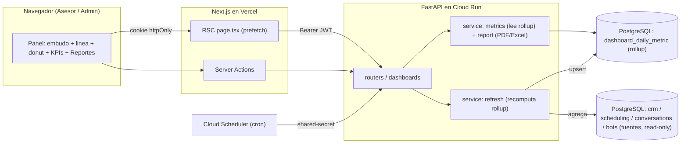
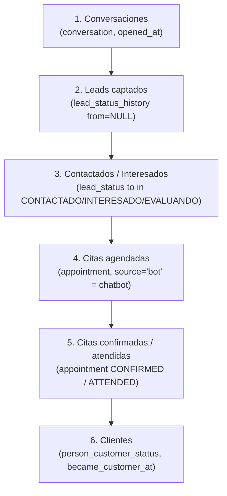
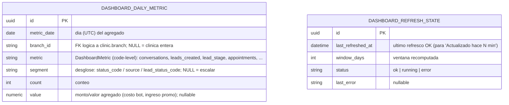
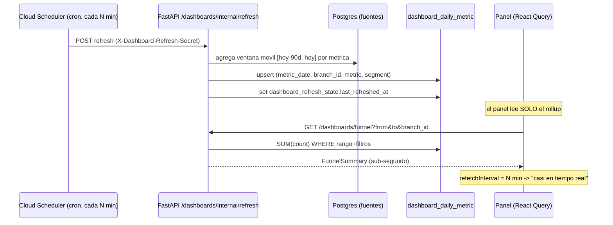
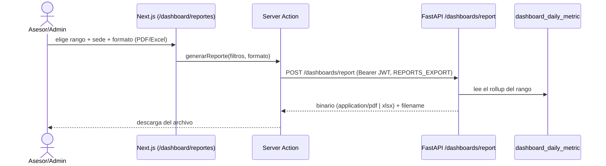
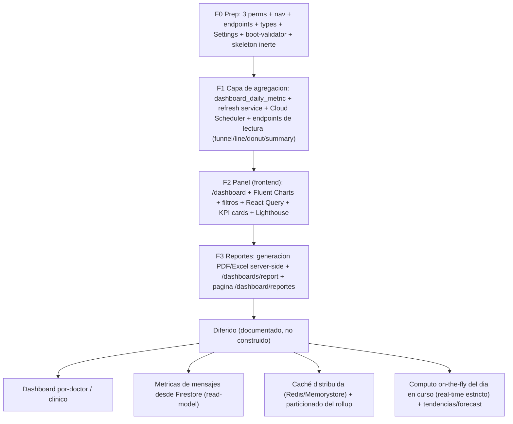

# Módulo `dashboards` — Documento de diseño

> **Última actualización**: 2026-06-24
> **Estado**: 🎨 **Diseño / discusión** (pre-implementación). NO hay código todavía.
> **Decisión de arquitectura**: [ADR-015](../../decisions/ADR-015-dashboards-materialized-aggregation.md).
> **Propósito**: módulo de **visualización de resultados y reportes en tiempo real** (OE3 de la tesis) centrado en un **embudo de conversión** (del primer contacto a la cita confirmada/cliente), más **evolución de leads** (línea), **distribución de citas** (donut) y **reportes exportables a PDF/Excel** (HU26 + HU27, épica E07). Cierra **OE3**, las **HU26/HU27** (hoy PENDIENTE en backlog), el **RNF-05** real, y elimina la incoherencia de la tesis (Cap.6 da el dashboard por "desplegado y funcionando" con figuras de un sistema anterior que ya no existe). Es el **módulo #10** (tras los 8 de dominio + calendar #9).

> Este documento es el **diseño consolidado** de esta fase. Antes de F0 se desglosa en las 4 fichas de costumbre (`README.md` + `backend.md` + `ui.md` + `frontend.md`). Aquí va la arquitectura, el modelo de la capa de agregación, el cómputo exacto del embudo, las visualizaciones, la UI y el roadmap por fases.

---

## 1. Resumen ejecutivo

**La data del embudo YA existe en producción** (crm, scheduling, conversations, bots, marketing). Este módulo **no crea fuentes de datos del negocio** — solo **agrega** lo que ya hay y lo **visualiza**. La única persistencia nueva es una **capa de agregación materializada** (un *rollup* diario) que se recalcula por un job programado, para cumplir el **RNF-05** (panel ≤ 3 s, LCP ≤ 2.5 s) sin recomputar agregaciones pesadas en cada carga.

El embudo de conversión se une **enteramente por `person_id`** (toda entidad del recorrido cuelga de `crm.Person`). Las etapas del embudo de lead son un **catálogo configurable** (ADR-008): hoy `NUEVO → INTENTANDO_CONTACTAR → CONTACTADO → INTERESADO → EVALUANDO → CITA_AGENDADA` (único `is_won`) / `NO_INTERESADO`; las de cita son 8 estados (`SCHEDULED … ATTENDED / NO_SHOW / CANCELLED / RESCHEDULED`). El dashboard **resuelve estados por `code`/flags, nunca por id hardcodeado.**

```
   fuentes en prod (read-only)                 capa nueva (este módulo)            UI
   ┌─ crm: lead/customer status + history ─┐   ┌─ dashboard_daily_metric ──┐   ┌─ Panel /dashboard ─┐
   ├─ scheduling: appointment + status ────┤──▶│  (rollup por día×sede×     │──▶│ embudo + línea +    │
   ├─ conversations: conversation ─────────┤   │   métrica×segmento)        │   │ donut + KPIs        │
   └─ bots: bot_event (turnos) ────────────┘   │  refrescado por job (cron) │   └─ Reportes /…/reportes
                                               └────────────────────────────┘     (PDF/Excel server-side)
```

**Alcance (DECIDIDO con el usuario, 2026-06-24 — ver [§15](#15-decisiones)):**

- **Embudo COMPLETO cross-módulo** (6 etapas): `Conversaciones → Leads → Contactados/Interesados → Citas agendadas → Citas confirmadas → Clientes`.
- **Agregación MATERIALIZADA / precomputada + caché**: rollup diario en Postgres refrescado por un job programado (Cloud Scheduler + endpoint con shared-secret, molde [ADR-012](../../decisions/ADR-012-cloud-tasks-bot-dispatch.md)) + caché TTL en React Query. Sin Redis (materialización nativa).
- **Gráficos = Fluent UI Charts** (`@fluentui/react-charts`, v9; mismos tokens que el resto → cero fricción de theming). Resuelve la contradicción de la tesis a favor de §6.2.3.
- **Reportes PDF/Excel = SERVER-SIDE** (el backend genera el binario; el front solo lo descarga vía Server Action).

**Lo que NO es este módulo**: no crea entidades de negocio, no muta el embudo (es 100% lectura/agregación), no toca `compute_available_slots` ni ningún flujo de los otros módulos. Diferido (documentado, no construido): dashboards por-doctor, métricas de mensajes desde Firestore, caché distribuida (Redis/Memorystore), analítica predictiva.

---

## 2. Por qué este módulo (tesis)

| Driver de la tesis | Qué exige | Cómo lo cubre este módulo |
|---|---|---|
| **OE3** | Visualización de resultados + dashboards en tiempo real que consoliden la atención y faciliten el seguimiento del ciclo (PC3, trazabilidad). | El panel + el embudo cross-módulo trazan el ciclo lead→bot→cita→cliente con `person_id`. |
| **HU26 (Must)** | "Visualizar gráficos de conversiones y conversaciones del chatbot aplicando filtros (fecha, estado), visión global y en tiempo real." → optimizar consultas de agregación. KPI: tasa de conversión. | Embudo + donut + línea con filtros (rango, sede, origen); rollup materializado = la "optimización de consultas de agregación". |
| **HU27** | "Generar reportes de conversiones y conversaciones por rango de fechas (históricos)." → exportación **PDF y Excel**. | Página de Reportes + generación server-side (PDF con figuras + Excel). |
| **RE3.2 (prototipo)** | Embudo (centro), Evolución de leads (línea), Distribución de citas (donut), reportes PDF/Excel. | Las 3 visualizaciones + reportes, 1:1. |
| **RNF-05** | Panel ≤ 3 s (p95), LCP ≤ 2.5 s (Lighthouse). | Rollup materializado + prefetch SSR + `next/dynamic` de los charts + caché TTL. Ver [§12](#12-rendimiento-rnf-05). |

Construir esto **reemplaza las Figuras 17/18/19 del Cap.6** (capturas de un sistema viejo) por el dashboard real, y mueve **HU26/HU27** de PENDIENTE a "Sí" en el backlog. Ver [[project-medisage-thesis]].

---

## 3. Arquitectura

El browser nunca habla con FastAPI directo (regla del template): el panel corre como RSC + Server Actions; las agregaciones corren **server-side** sobre el rollup; los reportes se generan en el backend y se descargan vía Server Action.



Dos planos:
- **Plano de lectura (caliente, por request)**: el panel pide KPIs/series → el service `metrics` **lee el rollup** (`dashboard_daily_metric`) y suma sobre el rango+filtros. Barato y constante (RNF-05).
- **Plano de cómputo (frío, por cron)**: Cloud Scheduler dispara `/dashboards/internal/refresh` (auth shared-secret) → el service `refresh` **recalcula el rollup** sobre una ventana móvil agregando las tablas fuente. Es el único punto que escanea las fuentes.

---

## 4. El embudo de conversión (cómputo EXACTO)

Verificado contra el código (Workflow de mapeo 2026-06-24, 6 agentes, citas `path:línea` en [`backend.md`](backend.md)). Todo se une por `person_id`. Dos lentes: **flujo/cohorte** (qué entró a cada etapa en el rango, vía las tablas `*_history` append-only) y **stock** (estado actual). El panel usa flujo para el embudo histórico y stock para "ahora".



| # | Etapa | Fuente exacta (código) | Conteo | Exacto? | Por **sede**? |
|---|---|---|---|---|---|
| 1 | **Conversaciones** | `conversation` (control plane Postgres; mensajes en Firestore, ADR-011). | `COUNT(DISTINCT person_id)`, `opened_at ∈ rango`. Sub-conteo "chatbot" = `assignee_type='bot'` ó `EXISTS(bot_event)`. | Exacto | ✗ (sin `branch_id` → clínica entera) |
| 2 | **Leads captados** | `lead_status_history` con `from_lead_status_id IS NULL` (cada lead nace en `NUEVO`). | `COUNT(DISTINCT person_id)`, `changed_at ∈ rango`. | Exacto | ✗ |
| 3 | **Contactados / Interesados** | `lead_status_history.to ∈ {CONTACTADO, INTERESADO, EVALUANDO}` (o `person_lead_status` actual). | `COUNT(DISTINCT person_id)`. Resolver codes por catálogo. | Exacto | ✗ |
| 4 | **Citas agendadas** | `appointment` (toda fila nace `SCHEDULED`). Origen chatbot = `source='bot'`. | `COUNT`, `scheduled_for`/`created_on ∈ rango`. Excluir `RESCHEDULED` (genera cita hija → doble conteo). | Exacto | ✓ `branch_id` denorm |
| 5 | **Citas confirmadas / atendidas** | `appointment` con `status=CONFIRMED`/`ATTENDED` (o `confirmed_at`/`attended_at IS NOT NULL` = "alguna vez llegó a"). | `COUNT`. Hito-acumulado por `*_at` ó estado-actual por `status_id` (no mezclar — el donut usa estado actual). | Exacto | ✓ |
| 6 | **Clientes** | `person_customer_status` (`became_customer_at`; lo crea **solo** `attend()→ATTENDED`, atómico). | `COUNT`, `became_customer_at ∈ rango`. | Exacto | ✗ (aprox. por sede de la 1ª cita) |

**Tasas etapa-a-etapa** (numeradores/denominadores explícitos para evitar ambigüedad):
- **Tasa de conversión global (KPI HU26)** = `leads que llegaron a CITA_AGENDADA / leads captados` en el rango (exacto vía `lead_status_history`). *Nota: el único `is_won` del catálogo es `CITA_AGENDADA`.*
- Tasa contacto→lead, lead→cita, cita→confirmada, cita→atendida (show rate), cliente. Detalle de fórmulas en [§7](#7-kpis-y-métricas).

**Caveats que el diseño respeta** (todos verificados en código):
1. **`person_lead_status` se soft-deletea al entrar a un estado `is_final`** (`CITA_AGENDADA`/`NO_INTERESADO`) → el "stock vivo" **no** contiene ganados/perdidos. Los conteos de embudo por flujo se sacan de `lead_status_history` (append-only, inmutable), no del stock.
2. **`APPOINTMENT_BOOKED`/`APPOINTMENT_CANCELLED` están en el enum `ActivityType` pero NUNCA se emiten** → el embudo **NO** se cuenta por el timeline polimórfico, se cuenta por `status` + filas de `appointment`. (Solo `APPOINTMENT_ATTENDED` se emite.)
3. **El salto del lead a `CITA_AGENDADA` (is_won) que dispara `create_appointment` es best-effort** (puede no saltar si la matriz lo prohíbe) → para "citas" se cuenta `appointment`, **nunca** el estado `is_won` del lead (subcontaría).
4. **Solo `appointment` tiene `branch_id`** (denormalizado) → el filtro por sede es exacto de la etapa "cita" en adelante; las etapas previas (conversaciones, leads) son a nivel clínica (se etiqueta el caveat en la UI).
5. **Estados configurables (ADR-008)** → resolver por `code`/flags (`is_won`, `is_final`, `is_active_attention`), nunca por id hardcodeado.
6. **`RESCHEDULED`** crea una cita hija (`previous_appointment_id`) → excluir o `DISTINCT person_id` para no doble-contar.

---

## 5. Modelo de datos — la capa de agregación materializada

El módulo **no tiene entidades de negocio**. Su única persistencia es el **rollup** + un registro de observabilidad del refresco. Mixins del template: `PK`=`PrimaryKeyMixin`, `A`=`ActiveMixin`, `T`=`TimestampMixin` (estas tablas **no** usan `SoftDeleteMixin` — son derivadas, se truncan/upsertean).



### `dashboard_daily_metric` (rollup / fact table diaria)

Una fila por `(metric_date, branch_id, metric, segment)`. El plano de lectura **suma** sobre el rango de fechas y filtra por `branch_id`/`segment` — todo indexado, sub-segundo.

- `metric_date: date` NOT NULL — día del agregado (frontera UTC; el render local lo maneja el front).
- `branch_id: varchar(36)` **nullable** (FK lógica a `clinic.branch`, sin constraint) — `NULL` = métrica a nivel clínica (conversaciones, leads, clientes, bot); con valor = métrica de citas por sede.
- `metric: varchar(40)` NOT NULL — enum **code-level** `DashboardMetric` (no catálogo en BD). Ver [§7](#7-kpis-y-métricas).
- `segment: varchar(60)` **nullable** — desglose dentro de la métrica: `status_code` (donut de citas), `lead_status_code` (línea de evolución), `source` (origen de cita), `bot` (sub-conteo chatbot). `NULL` = métrica escalar.
- `count: integer` NOT NULL default 0 — conteo agregado.
- `value: numeric(12,2)` nullable — valor monetario/numérico (costo estimado del bot, ingreso por promoción), `NULL` cuando la métrica es solo de conteo.
- **UNIQUE** `(metric_date, branch_id, metric, segment)`. Índice de cobertura `(metric, metric_date, branch_id)` para el rango+filtro del plano de lectura. **Refresco idempotente**: como `branch_id`/`segment` son nullable y en Postgres `NULL ≠ NULL` (un `ON CONFLICT` no dispararía para métricas de clínica/escalares), el refresco hace **DELETE de la ventana móvil + INSERT** (no `ON CONFLICT`) → reescribir el mismo período es idempotente.

> **Por qué un rollup genérico (key-value) y no N tablas por gráfico**: una sola fact table cubre embudo, donut, línea y KPIs con la misma forma `(día, sede, métrica, segmento) → conteo/valor`; el refresco la repuebla por `metric`; los endpoints suman/filtran. Es el patrón estándar de "daily rollup" de analítica, mínimo y flexible. Si un gráfico futuro necesita otro grano, se agrega una `metric` nueva (sin migración de esquema).

### `dashboard_refresh_state` (observabilidad del refresco)

Fila única (singleton) que guarda `last_refreshed_at` (para el badge "Actualizado hace N min" del panel) + `status`/`last_error` del último job. No es crítica para los datos; es para UX y diagnóstico.

### Índices nuevos en las tablas fuente (aditivos, para el job de refresco)

El job de refresco escanea las fuentes por **fecha**; varias columnas temporales **no están indexadas** hoy. La migración del módulo agrega (aditivo, sin tocar la lógica de los otros módulos — precedente: la migración de `marketing` agregó FKs a tablas de `crm`):

- `lead_status_history.changed_at` (hoy solo `person_id` y `source_campaign_id` indexados).
- `conversation.opened_at` (hoy solo columnas sueltas; sin índice temporal).
- `person_customer_status.became_customer_at` (TimestampMixin no indexa `created_on`). *(No se indexa `person.created_on`: ninguna métrica del rollup lo usa — `customers_new` va por `became_customer_at` — un índice sin lectura solo encarece la escritura.)*

`appointment` ya tiene el índice ideal `(branch_id, scheduled_for, status_id)` → no requiere índice nuevo.

---

## 6. Estrategia de agregación materializada + "tiempo real"

**Decisión del usuario**: materializada/precomputada + caché (sobre on-the-fly). Reconciliación con "tiempo real" de HU26:



- **Ventana móvil**: el job recomputa los últimos `DASHBOARD_REFRESH_WINDOW_DAYS` (default 90) **+ el día en curso** cada `DASHBOARD_REFRESH_INTERVAL_MINUTES` (default 10). Los días cerrados son inmutables (idempotente reescribir el mismo valor); el día en curso se refresca cada ciclo → **staleness ≤ intervalo**.
- **Disparo**: Cloud Scheduler → `POST /dashboards/internal/refresh` con **auth shared-secret** (`hmac.compare_digest`, molde exacto de `BOT_DISPATCH_SECRET` / [ADR-012](../../decisions/ADR-012-cloud-tasks-bot-dispatch.md); el servicio es público `--allow-unauthenticated` → shared-secret > OIDC, lección §11). Boot-validator `_enforce_dashboard_refresh_secret` (espejo de `_enforce_bot_dispatch_secret`): si el módulo está activo y `ENV≠dev` ⇒ exigir secret ≥ 32 o no arrancar.
- **Caché front (la "caché TTL por caducidad de KPIs" que nombra la tesis)**: React Query `staleTime` ≈ intervalo + `refetchInterval` ≈ intervalo → el panel se siente "vivo" sin recomputar nada (lee rollup). Sin websockets/SSE (sobre-ingeniería para agregados).
- **"Tiempo real" honesto**: el panel muestra **"Actualizado hace N min"** (de `dashboard_refresh_state`). Para clínicas que exijan el headline del día al segundo, el cómputo on-the-fly del **día en curso** (solo los escalares de "hoy") es una mejora aditiva diferida — el rollup ya cubre el RNF-05.
- **Sin Redis**: materialización nativa en Postgres. Memorystore/Redis para caché compartida entre instancias queda **diferido** (consistente con HARDENING §1, que prevé Redis solo para rate-limit distribuido).
- **sqlite (smoke)**: para el bucketing por **día** usar `func.date(col)` (compila en Postgres y en sqlite → el `group_by` corre idéntico en el smoke; verificar en F1 que corta en frontera UTC); reservar `date_trunc`/bucketing en Python solo para granos mayores (Postgres-only, lección §13: `JSONB`/`date_trunc` no compilan en sqlite). El plano de lectura (SUM sobre el rollup) corre idéntico en ambos dialectos.

---

## 7. KPIs y métricas

`DashboardMetric` (enum code-level, valores de la columna `metric`). Cada uno se materializa por día (× sede donde aplica, × segmento donde aplica):

| `metric` | Segmento | Fuente | Fórmula del refresco |
|---|---|---|---|
| `conversations` | `bot` \| `null` | `conversation` | `COUNT(DISTINCT person_id)` por `opened_at::date`; segmento `bot` = `assignee_type='bot' OR EXISTS(bot_event)`. |
| `leads_created` | — | `lead_status_history` | `COUNT(DISTINCT person_id)` con `from_lead_status_id IS NULL` por `changed_at::date`. |
| `lead_stage` | `lead_status_code` | `lead_status_history` | `COUNT(DISTINCT person_id)` por `to_lead_status_id` + `changed_at::date` → alimenta la **línea de evolución** y el embudo de lead. |
| `appointments` | `status_code` | `appointment` | `COUNT` por `status_id` + `scheduled_for::date` + `branch_id` → alimenta el **donut** y las etapas 4/5. Excluye `RESCHEDULED` del agregado "agendadas". |
| `appointments_source` | `source` (`bot`/`advisor`/…) | `appointment` | `COUNT` por `source` → atribución al chatbot. |
| `customers_new` | — | `person_customer_status` | `COUNT(DISTINCT person_id)` por `became_customer_at::date`. |
| `bot_turns` | — | `bot_event` | `COUNT(*) WHERE event_type='turn_completed'` por `created_on::date` (no `COUNT(*)` de toda la tabla: cada turno emite varios eventos). |
| `bot_cost` | — | `bot_event` | `value = SUM(COALESCE(cost_estimated_usd,0))`; `count = SUM(tokens_in+tokens_out)`. |

**KPIs derivados (el plano de lectura los compone sumando el rollup sobre el rango+filtros):**
- **Tasa de conversión** = `lead_stage[CITA_AGENDADA] / leads_created`.
- **Tasa lead→cita** = `appointments(agendadas, DISTINCT person) / leads_created`.
- **Tasa de confirmación** = `appointments[CONFIRMED+downstream] / appointments(total)`.
- **Show rate** = `appointments[ATTENDED] / (ATTENDED + NO_SHOW)`.
- **No-show rate** = `appointments[NO_SHOW] / (ATTENDED + NO_SHOW)`.
- **Tasa de cierre a cliente** = `customers_new / appointments[ATTENDED]` (o `/ leads_created`).
- **Aporte del chatbot** (`chatbot_share`) = `appointments[source='bot'] / appointments(total)` (aporte del bot a las citas, la métrica de negocio). `conversations_bot / conversations` (engagement) se expone aparte como campo propio de `KpiSummary`.

> **Convención de tasas (contrato, autoritativo)**: todas las tasas (`conversion_rate`, `rate_from_prev`, `chatbot_share`, `show_rate`, …) se exponen como **fracción 0–1**; el front formatea a `%`. Los montos `Numeric` (p.ej. `bot_cost_usd`) viajan como **string** en el wire (convención del template). El espejo TS (`frontend.md`) y los schemas Pydantic (`backend.md`) deben respetar esto.

> **Métrica imposible en SQL (documentar la limitación)**: "**número de mensajes**" (inbound/outbound) y "tiempo de primera respuesta a nivel mensaje" — los mensajes viven en **Firestore** (ADR-011), no en Postgres. Proxies disponibles: nº de conversaciones, nº de turnos del bot (`turn_count`/`bot_turns`), `last_message_at` (recencia). Agregar mensajes desde Firestore es una mejora diferida (read-model aparte).

---

## 8. Las visualizaciones (Fluent UI Charts)

`@fluentui/react-charts` (v9, sucesora de `@fluentui/react-charting`). Todos los charts son **client-only** (`"use client"`, miden el DOM) y se cargan con `next/dynamic({ ssr: false })` + `<Skeleton>` Fluent como fallback (saca el JS del chart del critical path → ayuda al LCP/RNF-05). Heredan el theming Griffel del `FluentProvider` (cero mapeo de colores). Los colores de los segmentos vienen de los **catálogos** (`lead_status.color`, `appointment_status.color`), no hardcodeados.

| Visualización | Componente Fluent | Datos | Notas |
|---|---|---|---|
| **Embudo de conversión** (centro) | `FunnelChart` si la versión lo trae; si no, un componente **bespoke** `ConversionFunnel` (barras horizontales decrecientes con tokens Fluent — precedente "bespoke dentro de Fluent" = `CalendarGrid` de scheduling). | Los 6 conteos de etapa + las tasas etapa-a-etapa. | A verificar en F2 qué charts expone la versión instalada; el bespoke es el fallback seguro. |
| **Evolución de leads** (línea) | `LineChart` (o `AreaChart`) | `metric='lead_stage'` agrupado por `metric_date`, una serie por estado destino (o "nuevos vs ganados vs perdidos"). | Eje X = días; el render local lo maneja el front (TZ navegador). |
| **Distribución de citas** (donut) | `DonutChart` | `metric='appointments'` sumado por `segment=status_code` en el rango+sede. | Centro = total de citas; colores del catálogo `appointment_status`. |
| **KPIs** (tarjetas) | `Card` + `Text` de `@fluentui/react-components` | Tasa de conversión, leads, citas, clientes nuevos, no-show rate, aporte del chatbot. | Fila superior del panel; con flecha de tendencia vs período anterior (diferible). |
| **Mini-panel chatbot** | `Card` + `LineChart`/cifras | conversaciones del bot, turnos, costo estimado, tokens. | Resalta el aporte del chatbot (eje de la tesis). |

---

## 9. Reportes PDF/Excel (server-side, HU27)



- **PDF** (`reportlab` o `weasyprint`): portada (clínica, rango, sede, generado-por/fecha) + tabla de KPIs + el embudo + la distribución de citas + la evolución de leads (figuras renderizadas server-side). Minimiza PHI (agregados, no nombres de pacientes — coherente con la Ley 29733).
- **Excel** (`openpyxl`): una hoja de KPIs + una hoja por dataset (embudo, citas por estado, leads por día) con celdas crudas para que el usuario las re-grafique. Números como números (no strings).
- **Por qué server-side**: coherente con "el browser nunca habla con FastAPI directo"; mejor fidelidad del PDF (figuras tal cual); el bundle del front no crece con libs pesadas. El endpoint devuelve el binario; el Server Action lo entrega como descarga.
- **Deps nuevas (backend)**: librería PDF + `openpyxl`. Lazy import (el boot/smoke sin la dep no rompe; igual que los adaptadores LLM/calendar).

---

## 10. Permisos (RBAC), navegación y endpoints

**Permisos** (3 nuevos; total 120 → 123, verificado contra `seed.py` en develop@6bf33bd: 120 codes hoy, incl. los 4 de calendar). Se consolidan en [`docs/modules/_seed-and-roles.md`](../_seed-and-roles.md) + `seed.py`:

```
MENU-DASHBOARDS  (reservado, igual que MENU-SCHEDULING/MENU-CALENDAR) ·
DASHBOARD_VIEW   (ver el panel: embudo + línea + donut + KPIs) ·
REPORTS_EXPORT   (generar/descargar reportes PDF/Excel)
```

**Roles seed** (forward-declarados; `_seed_role` filtra los inexistentes → se autoactivan, patrón scheduling/calendar F0):
- `ADMIN` — los 3.
- `ASESOR` — `DASHBOARD_VIEW` + `REPORTS_EXPORT` (HU26: "Asesor o Administrador"). *(El `MENU-*` reservado no se asigna; el gate de nav es el permiso fino.)*
- `DOCTOR` — ninguno del dashboard comercial (su vista operativa es "Mi agenda" en `scheduling`). *Diferible: un dashboard clínico por-doctor.*

**Endpoints** (aggregator `routers/__init__.py` prefix `/dashboards`, montado bajo `/api/v1/`). Convenciones del template: respuestas **no paginadas** `SingleResponse[X]` (molde `marketing.usage_summary`); request dedicado `DashboardFilter` (NO `QueryRequest` — no necesita paginación ni `ALLOWED_FIELDS`, y `QueryRequest` no tiene `between`).

| Método | Ruta | Permiso | Respuesta |
|---|---|---|---|
| `POST` | `/dashboards/funnel` | `DASHBOARD_VIEW` | `SingleResponse[FunnelSummary]` (6 etapas + tasas). |
| `POST` | `/dashboards/leads-evolution` | `DASHBOARD_VIEW` | `SingleResponse[TimeSeries]` (línea). |
| `POST` | `/dashboards/appointments-distribution` | `DASHBOARD_VIEW` | `SingleResponse[DistributionSummary]` (donut). |
| `POST` | `/dashboards/summary` | `DASHBOARD_VIEW` | `SingleResponse[KpiSummary]` (escalares + chatbot). |
| `POST` | `/dashboards/report` | `REPORTS_EXPORT` | binario (`application/pdf` \| xlsx) + `Content-Disposition`. |
| `POST` | `/dashboards/internal/refresh` | **shared-secret** (no JWT/RBAC) | `SingleResponse[RefreshResult]`. Target del Cloud Scheduler. |
| `GET` | `/dashboards/meta` | `DASHBOARD_VIEW` | `last_refreshed_at` + catálogos (estados/colores/sedes) para los selects y los colores del chart. |

> Cuerpo de filtro `DashboardFilter`: `{ date_from: date, date_to: date, branch_id?: str, source?: str, campaign_id?: str }`. Validación: `date_to >= date_from`, rango máximo configurable (p.ej. ≤ 1 año) para acotar el SUM.

**Navegación**: el panel **reemplaza** el placeholder de bienvenida en `/dashboard` (hoy un `<h1>Bienvenido</h1>` gateado por `MENU-HOME`). El item de nav "Inicio"/"Panel" se gatea por `DASHBOARD_VIEW`; un segundo child "Reportes" → `/dashboard/reportes` gateado por `REPORTS_EXPORT`. Hay que **registrar íconos de gráfico** en el `iconMap` del Sidebar (hoy no hay ninguno): `DataFunnelRegular`/`DataPieRegular`/`DataTrendingRegular`/`DocumentTableRegular` de `@fluentui/react-icons` (ya instalado). Para usuarios sin `DASHBOARD_VIEW`, `/dashboard` mantiene un welcome mínimo (sin redirect loop).

---

## 11. UI (ES, Fluent v9, sin estilo nuevo)

Mockups por pantalla, estados (empty/loading/error/sin-datos) y componentes en [`ui.md`](ui.md). Dos superficies:

**Pantalla 1 — `/dashboard` (Panel)**

```
┌─ Panel de conversión ───────────────────  Actualizado hace 4 min ⟳ ─┐
│ [ Rango: Últimos 30 días ▾ ] [ Sede: Todas ▾ ] [ Origen: Todos ▾ ]   │
├──────────────────────────────────────────────────────────────────────┤
│ ┌ Tasa conv. ┐ ┌ Leads ┐ ┌ Citas ┐ ┌ Confirmadas ┐ ┌ Clientes ┐ ┌ Bot ┐│
│ │   23.4%  ▲ │ │  412  │ │  138  │ │     96      │ │   71     │ │ 58% ││
│ └────────────┘ └───────┘ └───────┘ └─────────────┘ └──────────┘ └─────┘│
├──────────────────────────────────────────────────────────────────────┤
│  EMBUDO DE CONVERSIÓN                                                   │
│  Conversaciones        ████████████████████████  412                   │
│  Leads                 ██████████████████        356  (86%)            │
│  Contactados/Interes.  ████████████              241  (68%)            │
│  Citas agendadas       ████████                  138  (57%)            │
│  Citas confirmadas     █████                      96  (70%)            │
│  Clientes              ███                         71  (74%)            │
├───────────────────────────────┬──────────────────────────────────────┤
│  EVOLUCIÓN DE LEADS (línea)    │  DISTRIBUCIÓN DE CITAS (donut)         │
│   ╱╲    ╱╲╱╲                   │      ◔  Agendada 22 · Confirmada 18    │
│  ╱  ╲╱╲╱    ╲___               │         Atendida 71 · No asistió 9     │
│  nuevos · ganados · perdidos   │         Cancelada 12 · Reagendada 6    │
└───────────────────────────────┴──────────────────────────────────────┘
```

Estados: **loading** = skeletons de las cards + charts (no spinner global); **sin datos** = ilustración + "No hay datos en el rango seleccionado"; **error** = `MessageBar` + botón reintentar (no rompe el panel — cada widget falla aislado).

**Pantalla 2 — `/dashboard/reportes` (Reportes)**

```
┌─ Reportes ─────────────────────────────────────────────────────────┐
│ Genera un reporte histórico de conversiones y conversaciones.        │
│ [ Rango: 01/06 – 30/06 ▾ ] [ Sede: Todas ▾ ]                         │
│ Formato:  ( ) PDF   ( ) Excel                                        │
│ Incluye: ☑ KPIs  ☑ Embudo  ☑ Distribución de citas  ☑ Evolución      │
│                                          [ Generar y descargar ⬇ ]   │
└──────────────────────────────────────────────────────────────────────┘
```

Estado **generando** = botón con spinner + deshabilitado; **error** = `MessageBar`.

---

## 12. Rendimiento (RNF-05)

| Exigencia | Cómo se cumple |
|---|---|
| **Panel ≤ 3 s (p95)** | El plano de lectura **solo suma el rollup** (`dashboard_daily_metric`, tabla chica, indexada por `(metric, metric_date, branch_id)`) → sub-segundo. Nada escanea las fuentes en el request. |
| **LCP ≤ 2.5 s** | RSC `page.tsx` prefetcha el summary y pasa `initialData` (primer render sin round-trip). Los charts pesados van con `next/dynamic({ssr:false})` → fuera del critical path. KPI cards (texto) pintan primero. |
| **"Tiempo real"** | `refetchInterval` ≈ intervalo de refresco; badge "Actualizado hace N min". |
| **Escala** | Volumen de una clínica = chico; el rollup acota el costo a O(días×sedes×métricas). Si crece, Memorystore/Redis (caché compartida) + particionado del rollup, diferidos. |

Auditar con Lighthouse en F2 (la tesis pide la evidencia; reemplaza la Figura del "Lighthouse 95" del sistema viejo).

---

## 13. Cómo este módulo NO toca los demás

| Punto | Este módulo | Garantía |
|---|---|---|
| Lógica de crm/scheduling/conversations/bots | **Solo lee** (agrega). No muta ni una fila de negocio. | Imposible introducir un bug funcional en el embudo. |
| `compute_available_slots`, booking, lifecycle | **No se tocan.** | El agendamiento es idéntico. |
| Migración | Crea `dashboard_daily_metric` + `dashboard_refresh_state` + **índices aditivos** en tablas fuente (`lead_status_history.changed_at`, `conversation.opened_at`, `person_customer_status.became_customer_at`). | Aditivo; precedente: la migración de `marketing` agregó FKs a `crm`. Nulificación no aplica (no hay constraints nuevas sobre datos existentes). |
| Falla del job de refresco | El panel sirve el último rollup bueno + el badge muestra "Actualizado hace N min" (que crecerá). | Degrada con gracia; nunca rompe el panel ni los otros módulos. |

---

## 14. Roadmap por fases

Migración inicial `0026_dashboard_metric` (revid ≤ 32; la última aplicada es `0025_calendar_connection`). Molde global: **scheduling** (F0 inerte), **marketing** (`usage_summary` = endpoint de métrica agregada), **bots** (shared-secret + Cloud Scheduler/Tasks).



| Fase | Alcance | Migración |
|---|---|---|
| **F0 — Prep** | 3 perms `DASHBOARD*` + role subsets (forward) + nav (panel/reportes + íconos) + `endpoints.ts` bloque `DASHBOARDS` + `types/dashboards.types.ts` espejo + Settings (`DASHBOARD_REFRESH_SECRET`, `_INTERVAL_MINUTES`, `_WINDOW_DAYS`) + boot-validator + **paquete backend inerte** (no registrado). QA E2E/PROD RO = login admin + perm count + rutas `/dashboards/*` → 404. | ninguna |
| **F1 — Capa de agregación + lectura** | `dashboard_daily_metric` + `dashboard_refresh_state` + service `refresh` (recompute rollup, Postgres `date_trunc` / Python en sqlite) + endpoints funnel/leads-evolution/appointments-distribution/summary/meta (leen rollup) + `/internal/refresh` (shared-secret) + **registrar el módulo** + infra Cloud Scheduler (cron → refresh) + índices aditivos. Backend-only → QA E2E real (refresca y lee en Postgres). | `0026_dashboard_metric` (+ índices fuente) |
| **F2 — Panel (frontend)** | `/dashboard` (reemplaza placeholder) con Fluent Charts (funnel/línea/donut) + KPI cards + filtros + React Query (`refetchInterval`) + estados + nav. Auditar Lighthouse. Frontend-only. | ninguna |
| **F3 — Reportes** | Generación server-side PDF/Excel (`reportlab`/`weasyprint` + `openpyxl`, lazy) + `POST /dashboards/report` + página `/dashboard/reportes`. | ninguna |
| **Diferidas (D1–D4)** | por-doctor · mensajes Firestore · Redis · real-time estricto + forecast. **Documentadas, no se construyen.** | — |

---

## 15. Decisiones

**LOCKED (AskUserQuestion 2026-06-24) — NO re-litigar:**
1. **Embudo COMPLETO cross-módulo** (6 etapas: Conversaciones → Leads → Contactados/Interesados → Citas agendadas → Citas confirmadas → Clientes).
2. **Agregación MATERIALIZADA / precomputada + caché** (rollup diario + job programado + caché TTL React Query; sin Redis). Reconciliada con "tiempo real" vía ventana móvil + badge "Actualizado hace N min" + refetch (ver [§6](#6-estrategia-de-agregación-materializada--tiempo-real)).
3. **Gráficos = Fluent UI Charts** (`@fluentui/react-charts`). Resuelve la contradicción de la tesis a favor de §6.2.3 → actualizar la Tabla 10 de la tesis a Fluent Charts.
4. **Reportes = SERVER-SIDE** en FastAPI (PDF + Excel).

**Resueltas por análisis (defaults documentados, ajustables):**
5. **Módulo nuevo `dashboards`** (read-only, sin entidades de negocio).
6. **Permisos por rol**: ADMIN + ASESOR (panel + export); DOCTOR fuera del dashboard comercial. **Scope por sede = filtro** (single-tenant; no es seguridad por fila), exacto de la etapa "cita" en adelante; etapas previas a nivel clínica.
7. **`/dashboard` = el panel** (reemplaza el welcome placeholder); `/dashboard/reportes` = export.

**Abiertas (a confirmar/ajustar en la fase de doc o F0, defaults razonables):**
- Intervalo de refresco (default 10 min) y ventana del rollup (default 90 días).
- Si la "tasa" del KPI muestra tendencia vs período anterior (diferible).
- Si el `FunnelChart` nativo de la versión instalada de Fluent Charts alcanza, o se hace el `ConversionFunnel` bespoke (decidir al instalar en F2).
- Librería PDF concreta (`reportlab` vs `weasyprint`) — decidir en F3 según fidelidad de figuras vs simplicidad.

---

## 16. Referencias

- **Decisión**: [ADR-015](../../decisions/ADR-015-dashboards-materialized-aggregation.md) (módulo read-only, rollup materializado + job, reportes server-side, Fluent Charts).
- **Deep-dives**: [`README.md`](README.md) · [`backend.md`](backend.md) · [`ui.md`](ui.md) · [`frontend.md`](frontend.md).
- **ADRs reutilizados**: [ADR-008](../../decisions/ADR-008-configurable-status-transition-matrix.md) (estados configurables → resolver por code/flags), [ADR-009](../../decisions/ADR-009-forward-fk-deferred-cross-module.md) (FKs forward `source_campaign_id`/`related_*`), [ADR-011](../../decisions/ADR-011-firestore-message-stream-cqrs.md) (mensajes en Firestore → no agregables en SQL), [ADR-012](../../decisions/ADR-012-cloud-tasks-bot-dispatch.md) (shared-secret + dispatch async → molde del refresco), [ADR-013](../../decisions/ADR-013-marketing-campaign-status-and-atomic-apply.md) (`usage_summary` = molde de endpoint de métrica).
- **Módulos fuente (read-only)**: [`crm`](../crm/README.md) (lead/customer status + history), [`scheduling`](../scheduling/README.md) (appointment + status), [`conversations`](../conversations/README.md) (conversation), [`bots`](../bots/README.md) (bot_event), [`marketing`](../marketing/README.md) (promotion_usage — ingreso/atribución).
- **Código (puntos de lectura, citas exactas en [`backend.md`](backend.md))**: `crm/models/lead_status_history.py` (eje del line chart), `crm/models/person_lead_status.py` (stock vs flujo + soft-delete), `scheduling/models/appointment.py:38-48` (índice `(branch_id, scheduled_for, status_id)`), `scheduling/services/transition.py:162-191` (ATTENDED→cliente), `bots/models/bot_event.py` (turnos), `marketing/repositories/promotion_usage.py:64-77` (`usage_summary` = molde de agregación), `core/seed.py:343-413` (catálogos de estado sembrados).
- **Tesis**: OE3, HU26/HU27 (E07), RNF-05, RE3.2; reemplaza Figuras 17/18/19 del Cap.6. Ver [[project-medisage-thesis]].
- **Prototipo Figma**: archivo maestro de la plataforma (`VZ5AYXID7R4x3iRbTpGEXh`) — referencia de diseño (requiere acceso de edición para el MCP; la UI se diseña dentro del design system Fluent).
